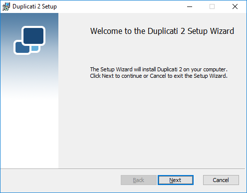
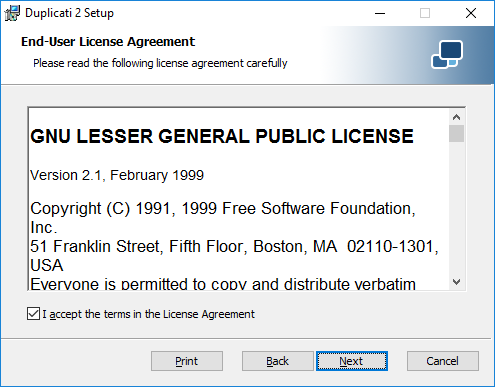
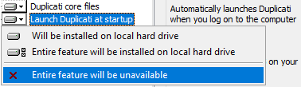
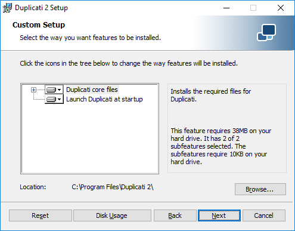
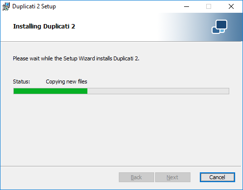
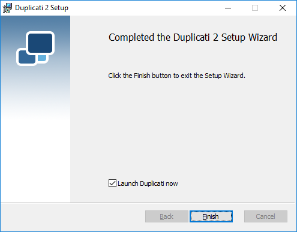
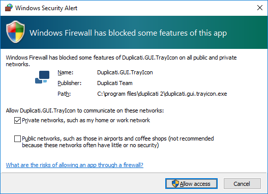
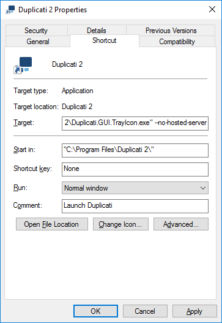

## Duplicati components

Before installing Duplicati, you should know how the different components relate to each other and how they can be configured. This makes it easier to decide how the software can be installed the way that matches your needs. The main components are:

* **The Server**  
When the Duplicati server is started, Duplicati can perform tasks in the background, like making backups, do restore operations and perform maintenance tasks.  
The server part has a built-in scheduler to start backup jobs automatically at regular intervals.  
For configuring new, of modifying existing backup jobs, change settings en monitoring running backups, a web server is included in the server component.  
If the server component starts, the webservice listens on the loopback interface, making it reachable from the local host only. The server tries to start listening on TCP port 8200\. If this port is unavailable (because of another running Duplicati server instance or another process that uses port 8200), port 8300 will be tried, increasing until an unused port is found. Port and interface can be customized by specifying some command line parameters.
* **The Command Line tools**  
Duplicati can make backups without loading the server component, using the command line tools. To schedule backups without using the server component, almost all task schedulers can be used, for example the Windows Task Scheduler (Windows) or Cron (Linux).  
Other command line tools can help with restore operations, recovering files from corrupted backups, installing the server component as a server, analyze communication with backends or update the software.
* **The Tray Icon**  
When started, the Duplicati Tray icon tool creates a small icon in the System Tray for easy access to the Duplicati Web Interface. The server component is included in the Tray Icon tool. After a default installation, the Tray Icon tool will be automatically started after a user logs on, making it unnecessary to configure the server component in an everyday use case.
* **The Service**  
Basically this is the same as the Duplicati Server component, but running as a Windows service. If Duplicati is registered as a Windows service, a small agent starts the server component and pings the server to verify it is running. If the server component is unreachable, the agent will restart it.

When a backup is made, Duplicati has the same permissions to the file system as the user context it is running in. If Duplicati is started with the Tray Icon tool, or if a user starts the Server component, or the command line tools are used, a backup can be made from all files that the user has read access to. Probably personal documents of other users that log on the same computer cannot be backed up by this instance.

However, other users can run their own Duplicati server instance (using different port numbers for the web server), which will give them access to their own personal files. The settings and backup configurations are stored at separate locations, so all users will see their own Duplicati environment.

If you want to be able to access all files on your computer and backup files from multiple users with the same Duplicati instance, the best option is to register Duplicati as a Windows service. Services are started by default with the Local System account. This account has NTFS permissions to the complete file system. Note that this will give the backup operator access to the files from all users that log on to the computer by using the source file picker in the Duplicati Web interface. It is highly recommended to secure the web interface with a strong password in this case.

Registering Duplicati as a service could also be a solution if you want to make use of Volume Shadowcopy Services (VSS), but your user account does not have administrative privileges.


*****
>  Running Duplicati using the Tray Icon causes the Duplicati Server component to start after the user logs on. If you want Duplicati to be able to run backups after a restart, before a user logs on, consider registering Duplicati as a service.

*****

## Prerequisites

*****
 Duplicati depends on other software. For Windows, Microsoft .NET Framework 4.5 or higher needs to be installed. Linux and Mac OS X require Mono to be installed.

If your system has no or an outdated version of the .NET Framework, download the latest version from [https://www.microsoft.com/net/download/framework](https://www.microsoft.com/net/download/framework) and install it.

To be able to backup files that are in use by another process, Duplicati uses AlphaVSS to accomplish this. AlphaVSS needs the Visual C++ run-time components for Visual Studio 2015. Download and install the binaries from [https://www.microsoft.com/en-us/download/details.aspx?id=48145](https://www.microsoft.com/en-us/download/details.aspx?id=48145). 

*****

*****
 Follow this procedure to install Mono on your Linux based system.</span></span>

**Ubuntu 16.04:**  
```nohighlight
sudo apt-key adv --keyserver hkp://keyserver.ubuntu.com:80 --recv-keys 3FA7E0328081BFF6A14DA29AA6A19B38D3D831EF

echo "deb http://download.mono-project.com/repo/ubuntu xenial main" | sudo tee /etc/apt/sources.list.d/mono-official.list

sudo apt-get update

sudo apt-get install mono-devel
```

**Ubuntu 14.04:**
```nohighlight
sudo apt-key adv --keyserver hkp://keyserver.ubuntu.com:80 --recv-keys 3FA7E0328081BFF6A14DA29AA6A19B38D3D831EF

echo "deb http://download.mono-project.com/repo/ubuntu trusty main" | sudo tee /etc/apt/sources.list.d/mono-official.list

sudo apt-get update

sudo apt-get install mono-devel
```

**Ubuntu 12.04:**
```nohighlight
sudo apt-key adv --keyserver hkp://keyserver.ubuntu.com:80 --recv-keys 3FA7E0328081BFF6A14DA29AA6A19B38D3D831EF

echo "deb http://download.mono-project.com/repo/ubuntu precise main" | sudo tee /etc/apt/sources.list.d/mono-official.list

sudo apt-get update

sudo apt-get install mono-devel
```

**Debian 9:**
```nohighlight
sudo apt-key adv --keyserver hkp://keyserver.ubuntu.com:80 --recv-keys 3FA7E0328081BFF6A14DA29AA6A19B38D3D831EF

echo "deb http://download.mono-project.com/repo/debian stretch main" | sudo tee /etc/apt/sources.list.d/mono-official.list

sudo apt-get update

sudo apt-get install mono-devel
```

**Debian 8:**
```nohighlight
sudo apt-key adv --keyserver hkp://keyserver.ubuntu.com:80 --recv-keys 3FA7E0328081BFF6A14DA29AA6A19B38D3D831EF

echo "deb http://download.mono-project.com/repo/debian jessie main" | sudo tee /etc/apt/sources.list.d/mono-official.list

sudo apt-get update

sudo apt-get install mono-devel
```

**Debian 7:**
```nohighlight
sudo apt-key adv --keyserver hkp://keyserver.ubuntu.com:80 --recv-keys 3FA7E0328081BFF6A14DA29AA6A19B38D3D831EF

echo "deb http://download.mono-project.com/repo/debian wheezy main" | sudo tee /etc/apt/sources.list.d/mono-official.list

sudo apt-get update

sudo apt-get install mono-devel
```

**Raspbian 9:**
```nohighlight
sudo apt-key adv --keyserver hkp://keyserver.ubuntu.com:80 --recv-keys 3FA7E0328081BFF6A14DA29AA6A19B38D3D831EF

echo "deb http://download.mono-project.com/repo/debian raspbianstretch main" | sudo tee /etc/apt/sources.list.d/mono-official.list

sudo apt-get update

sudo apt-get install mono-devel
```

**Raspbian 8:**
```nohighlight
sudo apt-key adv --keyserver hkp://keyserver.ubuntu.com:80 --recv-keys 3FA7E0328081BFF6A14DA29AA6A19B38D3D831EF

echo "deb http://download.mono-project.com/repo/debian raspbianjessie main" | sudo tee /etc/apt/sources.list.d/mono-official.list

sudo apt-get update

sudo apt-get install mono-devel
```

**CentOS 7:**
```nohighlight
yum install yum-utils

rpm --import "http://keyserver.ubuntu.com/pks/lookup?op=get&search=0x3FA7E0328081BFF6A14DA29AA6A19B38D3D831EF"

yum-config-manager --add-repo http://download.mono-project.com/repo/centos7/

yum install mono-devel
```

**CentOS 6:**
```nohighlight
yum install yum-utils

rpm --import "http://keyserver.ubuntu.com/pks/lookup?op=get&search=0x3FA7E0328081BFF6A14DA29AA6A19B38D3D831EF"

yum-config-manager --add-repo http://download.mono-project.com/repo/centos6/

yum install mono-devel

```
  
  
*****


*****
 Download the latest Mono version from [http://www.mono-project.com/download/](http://www.mono-project.com/download/). Run the .pkg file and accept the terms of the license.

Alternatively, you can install Mono using Homebrew:

```nohighlight
brew install mono
```


*****


## Downloading Duplicati

Duplicati can be downloaded from [https://www.duplicati.com/download](https://www.duplicati.com/download). Choose the version that matches your operating system. The Zip file version contains the binaries without an OS-specific installer. Use the Zip file version for a portable installation or if you want to use the Command Line tools only. This version can be used for all supported operating systems.

## Installing Duplicati on Windows

*****
 The installation procedure for Windows systems is pretty straightforward. Download the Windows MSI installer package from [https://www.duplicati.com/download](https://www.duplicati.com/download). If you have a 32 bit version of Windows, download the Windows 32 bit installer package.

First step is the Welcome screen. Click Next to proceed.




Read the license agreement. If you agree, select _I accept the terms in the License Agreement_ and click Next.




Select which components you want to install. Pay special attention to _Launch Duplicati at startup_. If it is selected, the Duplicati Tray Icon Tool will be started automatically after logging on to Windows. The Duplicati Server component is included in the Tray Icon tool. If you want to start the server component another way (i.e. by registering the server component as a Windows service), you have 2 options:

* Disable _Launch Duplicati at startup_.  

The Tray Icon tool will be installed, but not automatically started. You can start it manually by executing Duplicati.GUI.TrayIcon.exe.</span></span>
* Keep _Launch Duplicati at startup_ enabled, but modify the properties of the shortcut after the installation wizard has been completed.  
This will ease access to the Duplicati Web interface, but if you don't manually deactivate the internal server component, you will end up with multiple Duplicati instances, which is probably undesirable.


Click Next to proceed.  




Click the Install button to start the installation.


Wait for the installation procedure to complete.




If you don't want to start the Duplicati Tray Icon tool now (i.e. if you want to register it as a service), deselect _Launch Duplicati now_.

Click Finish to complete the installation wizard.




The first time the server component starts, Windows Firewall (or another third party firewall application) may show an alert. Allow Duplicati to communicate over the network.




## Configuring the Duplicati Tray Icon in Windows

If you have chosen _Launch Duplicati at startup_, but don't want to use the internal server component of the Tray Icon tool, you have to edit the properties of the Duplicati shortcut in the Windows Startup folder. You can find this shortcut in `C:\ProgramData\Microsoft\Windows\Start Menu\Programs\StartUp`

Browse to this folder and edit the properties of the Duplicati 2 shortcut. Add  `--no-hosted-server` to the Target field.  



A Duplicati icon will be shown in the system tray after logging in to Windows, but the Duplicati server component needs to be started separately.

*****
>  If you disabled Launch Duplicati at startup in the installation wizard and want to startup the Duplicati Server component during bootup time, you have to register Duplicati Server as a Windows service. See [Duplicati.WindowsService.exe](07-other-command-line-utilities/#duplicatiwindowsserviceexe) for more information.

*****


*****

