## Introduction to the Graphical User Interface

The most convenient way to configure and control Duplicati is using the Graphical User Interface. Duplicati provides an internal web server that allows the user to configure and schedule backup jobs, perform restore operations and apply settings. This web interface is available when Duplicati.Server.exe and/or Duplicati.GUI.TrayIcon.exe is/are running. The first instance of the web server is listening on TCP port 8200. Additional instances listen on port 8300 and higher.

After a standard installation, the web interface can be started by a click on the tray icon:  


Click _Open_ in the popup menu that shows up:  
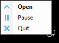


Note that the tray icon can have different colors:  
 Duplicati is inactive.  
 Duplicati is active. A backup job is running.  
 There is an error message that is not yet acknowledged.  

If you don't use the tray icon (for example if you disabled _Launch Duplicati at startup_ in the installation wizard), or if you want to call another Duplicati instance than the default one, open your web browser and enter the URL and port number in the address bar in your browser.

The default url is http://localhost:8200

This can be changed by providing command line options to Duplicati.Server.exe or Duplicati.GUI.TrayIcon.exe. See [Duplicati.GUI.TrayIcon.exe](07-other-command-line-utilities/#duplicatiguitrayiconexe), [Duplicati.Server.exe](07-other-command-line-utilities/#duplicatiserverexe) and [Duplicati.WinowsService.exe](07-other-command-line-utilities/#duplicatiwindowsserviceexe) for more information.

The first time you start the Duplicati Web interface, this message is presented:  
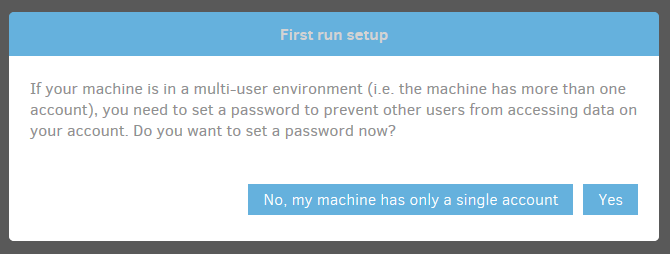

Pay special attention to this message. Everyone who has access to your computer (or even another computer in your network), could potentionally have access to your personal files by using the Duplicati Web interface. If Duplicati is installed as a service, even personal files from all users on the computer could be accessible.

For this and other security reasons, it is strongly recommended to set a password to the Web interface by clicking the _Yes_ button.

In the Settings page, which is displayed, you can set a password to the interface and optionally allow remote access to the webserver. If you grant remote access, note that you also need to open the appropriate TCP port in your firewall.  


Click the _OK_ button to save your changes. After supplying a password, you are logged out from the web interface and need to re-logon with your new password.  
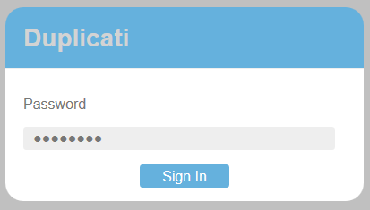


The Duplicati main window is displayed. The responsive design makes Duplicati easy to use on screens of all sizes, including mobile devices.

On larger screens, the main page looks like this:  
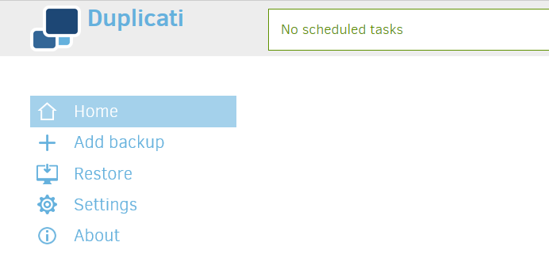


On screens with a lower resolution, Duplicati looks like this:  
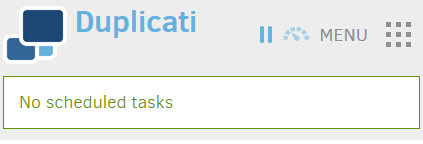

In this layout, a click on the Menu icon shows the main menu:  


## Components of the Graphical User Interface

At first run, the Duplicati screen is mostly empty. After one or backup backup jobs have been configured, this space will be used to present these backup jobs and some status information, giving you a quick impression of scheduling, the space used at the backend and how many versions are available. You can also start certain operations for a specific backup job here.

At the top of the page, you see the header, which consists of the Duplicati logo, the status bar, a pause button, a throttle button and some donation buttons.

The Duplicati logo tells what Update Channel you use.


If your initial Duplicati installation was a Beta version, The default Update Channel will be Beta. This can be changed in the Settings page.

The Status Bar shows information about the currently running Backup or Restore job. If no operation is active, the next scheduled backup job is showed here. If there are no scheduled backup jobs, the Status Bar shows "No scheduled tasks".

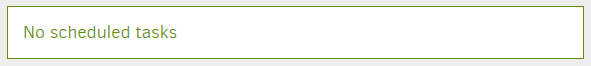

The Pause and Throttle buttons can be used for keeping control over the bandwidth used by Duplicati.


With the Pause button you can temporarily stop Duplicati uploading and downloading any file from and to the backend. With the Throttle button you can limit the bandwidth Duplicati uses by specifying a maximum upload and download speed.

If you like Duplicati, consider making a donation.


You can use these buttons to donate using PayPal or Bitcoin. Displaying these buttons can be disabled in the Settings menu.

The main menu can be found at the left side on high resolution screens or under the Menu button in the upper right corner when using a lower resolution, for example on mobile devices.

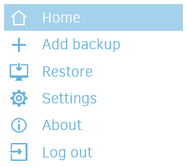

A short description of the menu items:

|                              |                                                            |
|------------------------------|------------------------------------------------------------|  
|  | Leave the current submenu and return to the home screen. |  
|  | Add a new backup configuration. |  
|  | Restore files from an already configured backup job or directly from the backend or from an imported configuration file. |  
|  | Change general program settings and define default settings for all backup jobs. |  
|  | Show the Duplicati log files and view events in real time. |  
|  | Show information about the current Duplicati version and system information. |  
|  | Logs out from the Duplicati Graphical User Interface. This item is omitted if no password is set to the User Interface. |  
 

## Creating a new backup job

New backup jobs can be configured and scheduled by clicking _Add backup_ in the main menu. Before the actual wizard starts, you can choose between _Configure a new backup_ and _Import from a file_. With _Import from a file_ you can import a configuration file that you exported earlier from the same computer or another computer running Duplicati. Because there is no configuration file available and we want to specify all options, we choose the first option and click _Next_.

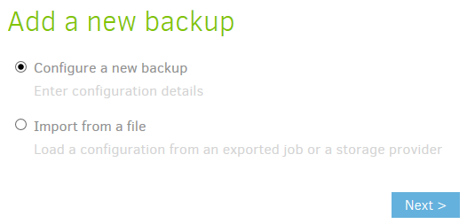

The wizard consists of 5 steps. In step 1 you can give the backup job a descriptive name and define the encryption settings.

*****
>  Losing your encryption key will render your backup files useless and makes restore operations impossible. Always store your encryption key in a safe place, separated from your backup files and not on your computer that contains the Duplicati source files.

*****

Enter a descriptive name, Select the encryption type and specify a strong encryption key. Duplicati gives an indication of the strengthness of the key you entered. Optionally Duplicati can generate a strong encryption key for you.

*****
>  Encryption can be disabled, but is strongly discouraged, especially if you upload your backup files over the internet to a public cloud storage solution. Click Next to continue.

*****


In step 2 you can specify the Storage Type you want to use for your backups and enter the URL, path and credentials. In this example, FTP is used, because it is an industry standard protocol that is easy to set up.

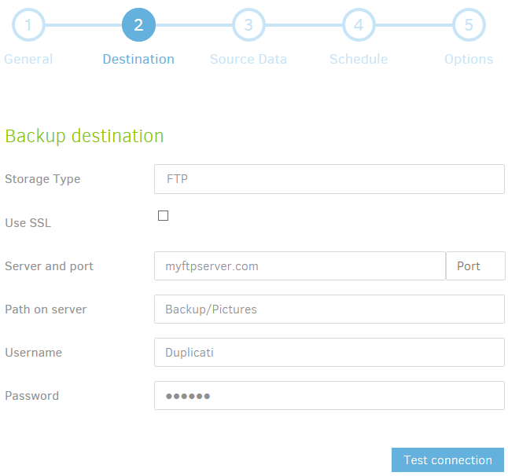

*****
>  Each Storage Type has its own requirements that you need to fill in. For an S3 compatible backend, you need to specify a Bucket name, region and storage class. For other backends, like Google Drive or Microsoft OneDrive, you need to create an AuthID token to grant permission to Duplicati to get access to that backend.

*****

If all required fields are filled in, you can optionally click the _Test connection_ button. Duplicati will try to connect to the backend using the provided information. If Duplicati can connect to the backend, but the specified folder does not exist, Duplicati can create it for you.

Under _Advanced options_ you can specify a number of settings that are specific for the storage type you selected. Pick a setting from the list to add it to the Advanced Options and change the setting as needed. Click _Next_ to proceed to step 3.

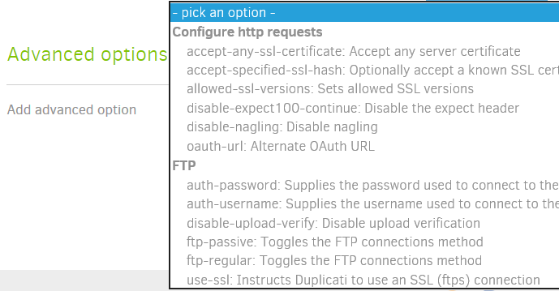

In step 3 you can select the files and folders you want to include in the backup. This can be done by selecting files and folders in the file picker. Only local files and folders can be selected using the file picker. If you want to include shared folders in your local network, you have to specify the path in the text box beneath the file picker.


*****
>  If you want to include one or more libraries, like My Documents or My Pictures, keep in mind that the file picker shows these location in the context of the user account that is used to start the server component. If you run Duplicati using the integrated server component in the System Tray tool (this is the default setup), then these libraries point to your personal folders. However, if you registered Duplicati as a service, these libraries point to the personal folders of the SYSTEM account, which are probably empty. To select your personal libraries, don?t use the My Documents/Music/Pictures/Videos/Desktop items, but drill down through the file system, probably `C:\Users\<Username>\Documents` etc.

*****

*****
>  Clicking an item in the file picker will add that item and all child items to the source selection list. This is indicated with a green check mark. Clicking it a second time changes the check mark to a red cross. This excludes that item an all child items from the backup.

*****

There's a small button in the upper right corner of the file picker:


Clicking it gives access to the advanced editor. In the advanced editor you can enter the files and folders you want to include in your backup instead of browsing to them.

*****
>  You can review your selections under Source data in the file picker.

*****

Under _Filters_ you can specify what you want to be excluded from the backup. If you deselected one or more files or folders in the file picker (marked with a red cross), they show up in the list under _Filters_. You can specify more exclusions based on file- or folder name, specific files or folders or even using a Regular Expression.  
There are default exclusion lists for Windows, Linux and OS X. Selecting the appropriate operating system excludes all files and folders that are known to be unneeded or impossible to be backed up (like temporary files, the paging file or the hibernation file). For Filters an advanced editor is available too using the button in the upper right corner.


Another way to avoid unneeded files to be backed up, is excluding files with a specific attribute or files that exceed a predefined file size. Select what you want to exclude under the _Exclude_ item. Click _Next_ for Step 4.

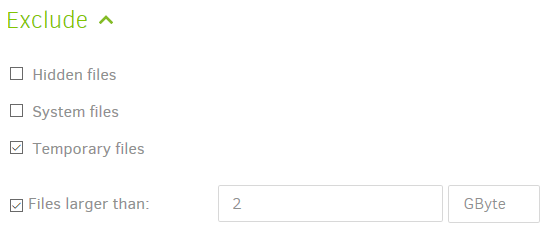

In step 4 you can schedule your backups. Selecting _Automatically run backups_ disables scheduling for this backup job. Once disabled, you can start the backup job manually when you want it to run. If you keep this enabled, you can specify how frequently and at which time the backup should be started. You can also exclude one or more weekdays.

If a backup job misses the defined schedule, for example if the computer is powered off, the backup job will start as soon as possible after the specified time. Click next to proceed to the final step.

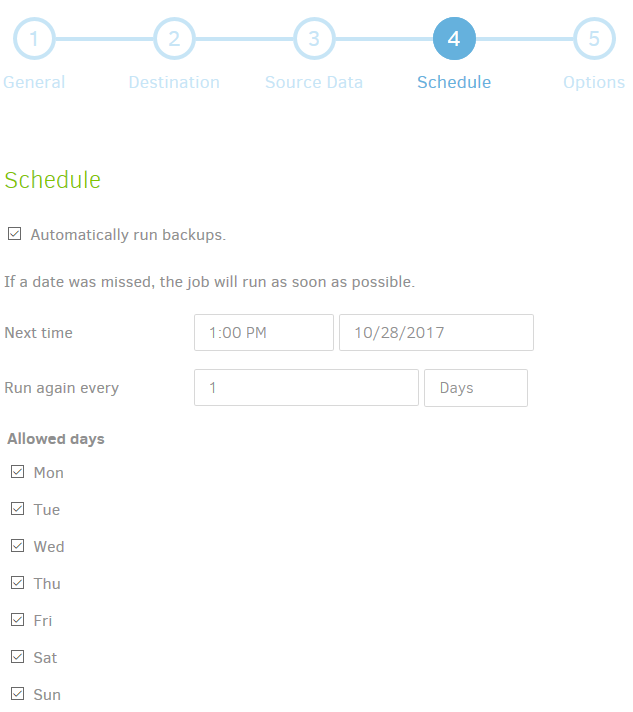

In step 5 you can set the Upload Volume size and how many backups should be available for restore operations.

An Upload Volume is an encrypted compressed file that contains a part of your backup. For normal backup operations you can keep this value unchanged, but in some scenarios, for example very large backups, you can increase size to reduce the number of files at the remote storage location. The default size for an Upload Volume is 50 MB. Increase this value if needed.

*****
>  The Upload volume size is not the maximum capacity that is offered by your storage provider. It is the size of each chunk of data that is uploaded to the backend during a backup operation. Increasing the size of an upload volume will reduce the number of files at the backend, but will require to download more data when performing restore operations. See [Choosing sizes in Duplicati]( 
appendix-c-choosing-sizes-in-duplicati) for more information about block- and volume sizes.

*****

The retention can be set in 3 ways:

* **Unlimited:**  
Backups will never be deleted. This is the most safe option, but remote storage capacity will keep increasing.
* **Until they are older than:**  
Backups older than a specified number of days, weeks, months or years will be deleted.
* **A specific number:**  
The specified number of backup versions will be kept, all older backups will be deleted.

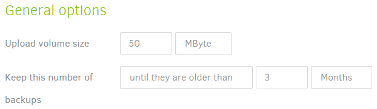

Under _Advanced options_ there is an extensive list of options to fine-tune your backup job. Click _Pick an option_ and select which option you want to set. This option is added to a list where you can change the value of that option.</span></span>

*****
>  This is only for advanced users. Don?t use this, unless you know exactly what you?re doing. Choosing incorrect values may cause unusable backups.

*****

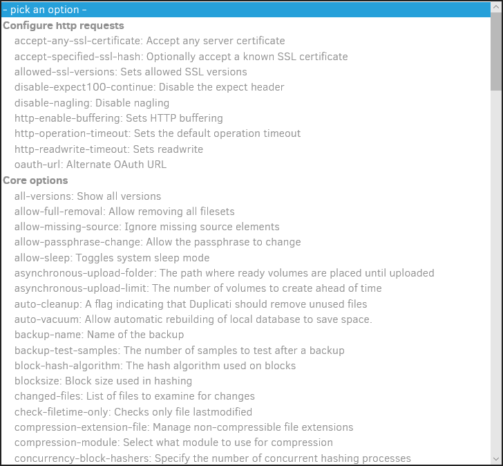

Click the _Save_ button. Your first backup job should show up in the main window.

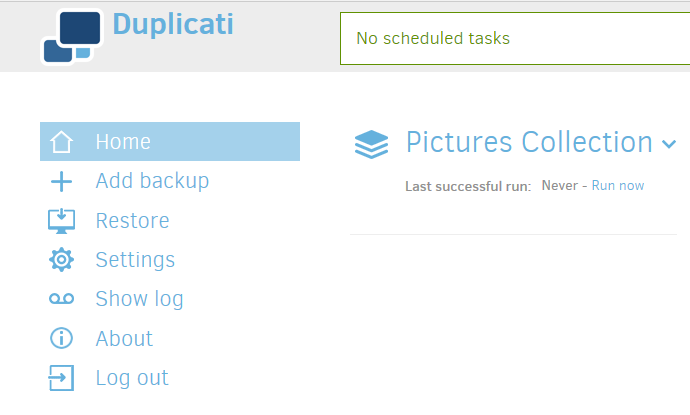

If you have a previously exported configuration file, you can import it by selecting _Import from a file_ in the _Add backup_ menu. N the next step you can browse to the location where your configuration file is stored, enter a passphrase if the configuration file is encrypted and click _Import_. If _Save immediately_ was deselected before the _Import_ button was clicked, you can review all 5 steps and make changes if desirable. Click the _Save_ button in step 5 to save your backup job configuration.

>  When importing a backup job from a configuration file, a new database will be created, using a random filename. If the configuration file contains the name of a local database, this name will be ignored. This will prevent problems caused by multiple backup jobs using the same local database.  
If you want to re-use an existing database, open the backup configuration’s Database menu after the job is imported. Enter the path and filename of the existing local database in the Local database path field.


## Running a backup job

There are 3 ways to start a backup using the Graphical User Interface:

* If it is a scheduled backup, just wait for the next scheduled time. The backup will start automatically.
* Click Run now, just under the backup name.  
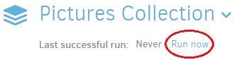
* Click on the backup name. Then click Run now under Operations.  


The progress bar indicates that the backup job starts:

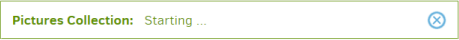

The first time a backup is executed, all data has to be divided into blocks, compressed, packaged into archive files, encrypted and uploaded to the backend. This can take a long time, depending on the amount of source data to be processed, the system performance and the network bandwidth to the backend. After the initial (full) backup, only new and changed data will be processed and uploaded, making successive backups much faster.

You can follow the progress in the progress bar, where the number of files and the amount of data to be processed will be showed. Also the current upload speed is displayed.


After all files have been processed, some additional operations are performed.


If there are files still uploading in the background, Duplicati will wait for them to complete.


After all files are uploaded, Duplicati will randomly choose a few upload volumes from the backend, download them and view if the contents are what Duplicati expects it to be.


After the backup has finished, the status bar will show when the next backup will run, if at least one backup job is scheduled.


If there were any warnings or errors during the backup, they will be displayed in the bottom of the main screen, including a links to the log files and a button to dismiss the alert.

After the first backup is completed, the Duplicati main screen will display some additional information about the backup:

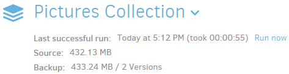


## Restoring files from a backup

If you want to restore one or more files from a backup, you can start the restore wizard:

* By clicking the backup name and click Restore files ? under Operations.  
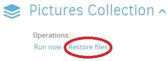
* By clicking Restore in the main menu, select the backup you want to restore from and clicking Next.  
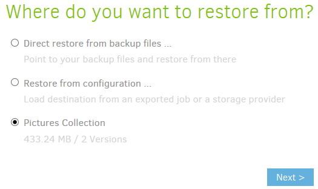

The Restore wizard consists of two steps. In step 1 you can specify what you want to restore and from which restore point you want to restore these files. In step 2 you can choose to what location you want to restore the files and supply some options for the restore operation.

In the first step, select the restore point from which you want to restore some files by selecting a date and time behind _Restore from_. Each restore point will list all files and folders included in the backup exactly as they were at the listed timestamp.

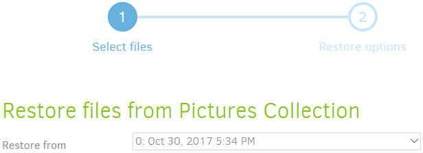

In the file browser, select all files and folders you want to restore. Selections will be marked with a green check mark. Clicking a folder will select that folder and all underlying files and folders. You can exclude files and folders inside a selected folder, by clicking them. The preceding check marks will be removed from the clicked objects. Folders that are partially selected are marked with a green square.

You can find files easily by typing a part of the filename in the _Search for files_ text box. Filenames containing your search query will be highlighted in the file browser.

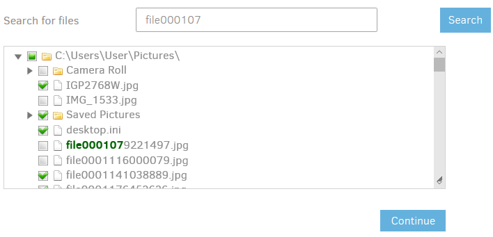

*****
>  Highlighting does not actually select the files you type in. Only files with a green check mark will be restored.

*****

If you have selected all files and folders you want to restore, click _Continue_ to proceed to step 2.

The second step allows you to specify a location to restore the selected files to. Choose _Original location_ to restore the files to their original location. Choosing _Pick location_ allows you to select an alternative location to restore your files to. You can do this by typing the folder path or selecting the root folder with the Browse button.

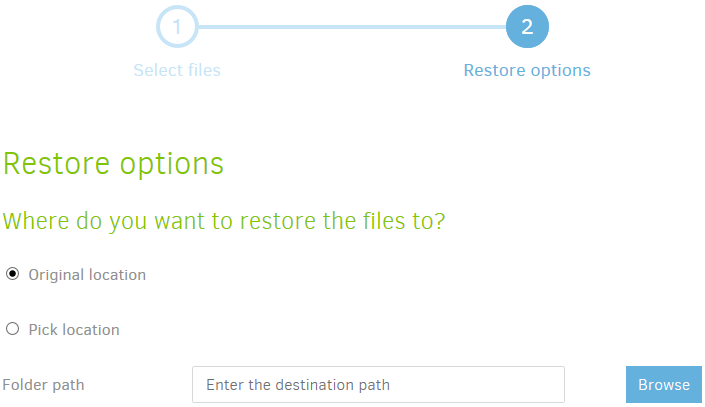

If you chose to restore to the original location, you can specify what Duplicati should do with files that already exist: overwrite them or restore to a new file with a timestamp in the file name.

You can also restore file access permissions. This is disabled by default, because doing this might prevent access to the files that you just restored.

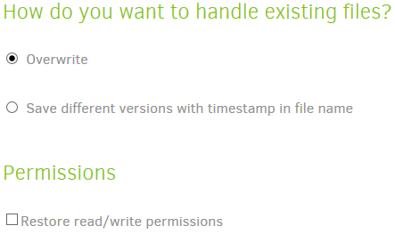

Clicking the Restore button will start the actual restore operation. The backup operation starts with scanning local files for blocks that are already available. This can reduce the amount of downloaded data from the backend significantly.

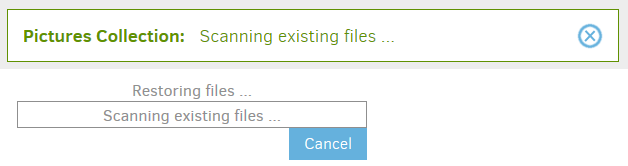

Next part of the restore process is downloading the required upload volumes from the backend for assembling the selected files and folders to restore.

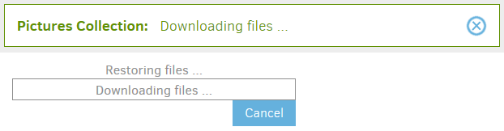

After the operation has been completed, Duplicati will notify you and encourage you to make a donation. The donation information can be disabled in the _Settings_ menu. Warnings or errors, if any, will be showed in the bottom part of the Duplicati main screen. Clock OK to return to the main screen.

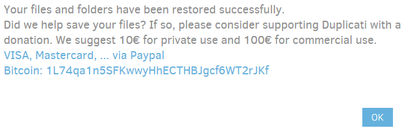

## Restoring files if your Duplicati installation is lost

If you want to restore your files without being able to use your Duplicati installation (for example on another computer, or after a system crash), you have to restore your files directly from the backup destination.

If Duplicati isn't installed on the computer you want to restore to, download and install Duplicati first. See [Installation](02-installation) for more information.

To start a restore operation without a configured backup job, click Restore in the main menu. You have 2 options:

* If you have exported the backup configuration earlier to a file and still have access to this file, you can import it and start restoring. This is the easiest option.
* If you don?t have an exported configuration file, you need to know the backend URL, credentials and the backup passphrase. Once entered all needed information, you can start restoring your files.

If you don't have a configuration file, you have to supply all needed information yourself. Select _Direct restore from backup files ..._ and click _Next_.

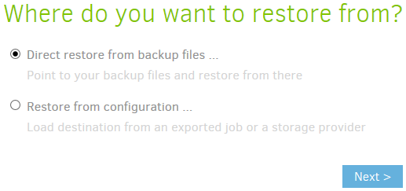

In Step 1 (Backup location), you have to select the correct Storage Type and fill in the required information to connect to the remote storage.

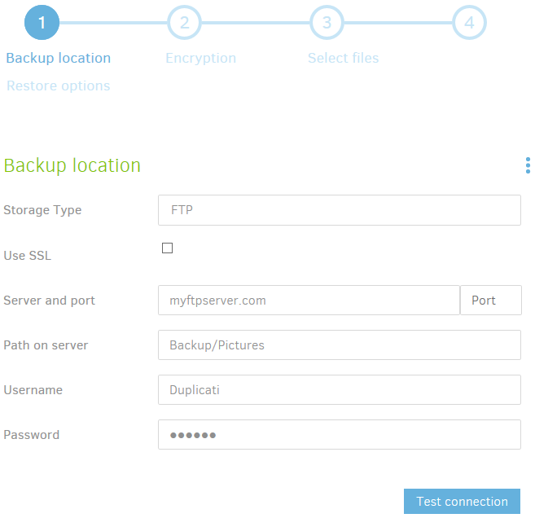

Click the _Test connection_ button to verify if the connection works. You should get a message indicating that the connection works.

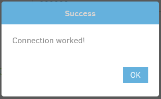

Optionally, supply one or more advanced options for the selected backend. Click next to proceed to step 2.

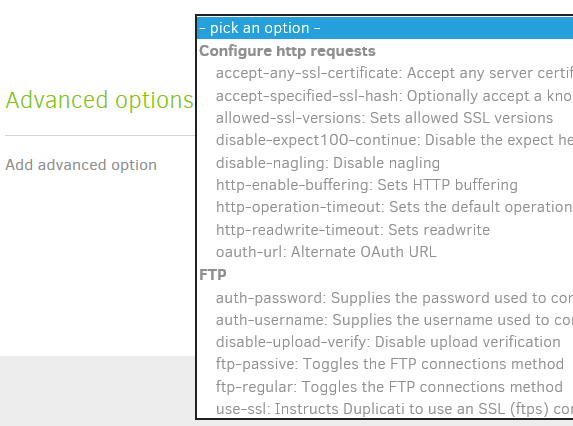

In step 2 (Encryption), specify the backup passphrase and optionally supply one or more advanced options.

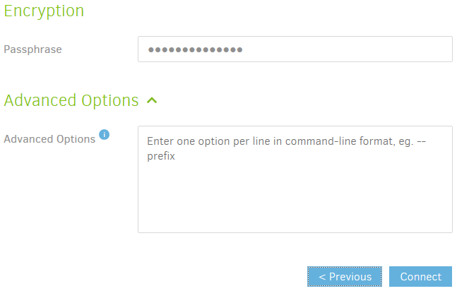

Click the _Connect_ button to retrieve backup information from the backend.

If you have a configuration file, select _Restore from configuration ..._ and click _Next_.

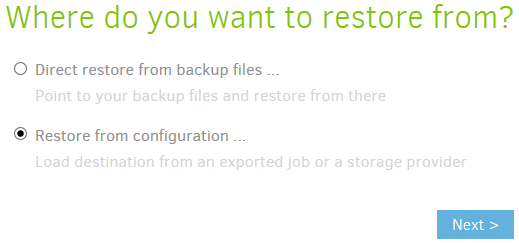

Browse to the location where the configuration file is stored. If this file was encrypted during the export, enter the passphrase in the text field. Click Import to continue.

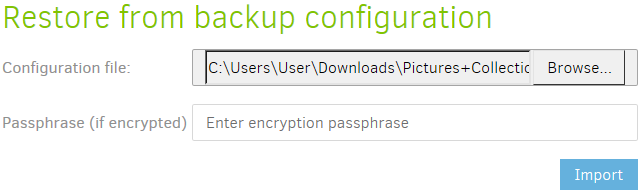

The restore wizard is showed. In step 1 (Backup location) all information to connect to the remote storage is filled in with the information from the configuration file. Click the _Test connection_ button to check if the connection works.

In step 2, the passphrase is already filled in. Click the _Connect_ button to proceed to step 3.

Duplicati connects to the remote storage and retrieves a list of available backups.

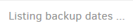

Then file information is being retrieved.

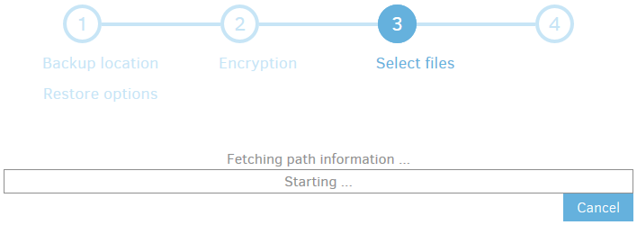

After the Fetching path information task has been completed, the restore process is exactly the same as described in [Restoring files from a backup](03-using-the-graphical-user-interface/#restoring-files-from-a-backup).

## Editing an existing backup

Sometimes changes need to be made to a backup configuration. If you create a new folder and want to add this folder as a backup source in your configuration, you have to edit the backup job. Other examples are changed credentials for the backend, defining another schedule and set or change some advanced options for your backup job.

To modify a backup job configuration, click the name of the backup job and click _Edit ..._ under _Configuration_.

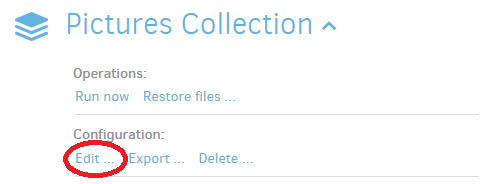

You return to the same wizard that was shown when adding the backup. The difference is that all 5 steps are already filled in with the settings you chose in the Add backup wizard.

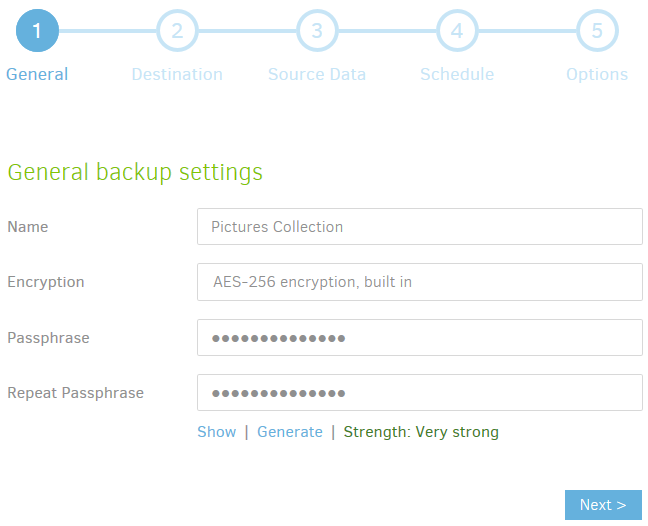

You can walk through the wizard by optionally change some settings and click _Next_ until you reach the last step of the wizard. You can also click the number of the step you want to edit in the selector at the top.

If all settings are correct, click the _Save_ button in step 5.

*****
>  Many settings can be modified, but some settings cannot be changed after the initial backup is made. For obvious reasons, the passphrase and the block size need to stay the same once the initial backup is completed.

*****

*****
>  Adding or modifying advanced options may have unwanted effects. Never modify settings in a backup configuration, unless you are sure what the consequences of the change are.

*****

## Exporting a backup job configuration

Backup job configurations can be exported in 2 ways:

* **As Command-line**  
If you don't want to use the Graphical User Interface to manage your backups and/or you want to use another task scheduler instead of the scheduler that is integrated in Duplicati, you can use the Command-line export to generate a command that you can use to perform the current backup job with the `Duplicati.CommandLine.exe` tool.
* **To File**  
When exporting to a file, a standard JSON file is generated that contains all settings of the selected backup job configuration. This file can be used later for importing in a new Duplicati installation if your computer is lost because of a disaster.

To export a backup job configuration, click its name and click _Export ..._ under _Configuration_.

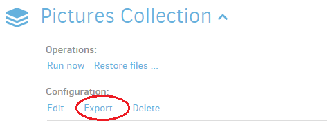

To export the current configuration as a ready-to-use command, select _As Command-line_ and click the _Export_ button.


The result is a Duplicati backup command that you can use with a scheduler of your choice.

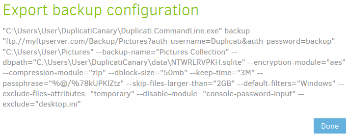

If you want to export to a file, select _To file_ and click the _Export_ button.

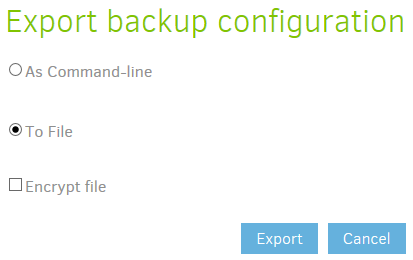

If you select _Encrypt file_, you can enter a passphrase to scramble your configuration file, making it unreadable for others.

 Configuration files contain sensitive information, like your backup passphrase and credentials to authenticate to your backend. This information is stored as plain text in unencrypted configuration files. If you choose not to encrypt the configuration file, be sure to store it somewhere nobody else has access to.

 Losing the passphrase will make the configuration file useless. Without the passphrase it is impossible to extract information from the configuration file. Store the passphrase in a safe place.

 Never store the configuration file and ? if applicable ? the passphrase on the computer running Duplicati. It is likely that you need them when your computer is lost. Be sure to keep access to file and passphrase if you can?t use your computer anymore.

The contents of the file (in unencrypted form) could look something like this:

```nohighlight
{
  "CreatedByVersion": "2.0.2.12",
  "Schedule": null,
  "Backup": {
    "ID": "1",
    "Name": "Pictures Collection",
    "Tags": [],
    "TargetURL": "ftp://myftpserver.com/Backup/Pictures?auth-username=Duplicati&auth-password=backup",
    "DBPath": "C:\\Users\\User\\DuplicatiCanary\\data\\NTWRLRVPKH.sqlite",
    "Sources": [
      "%MY_PICTURES%"
    ],
    "Settings": [
      {
        "Filter": "",
        "Name": "encryption-module",
        "Value": "aes",
        "Argument": null
      },
      {
        "Filter": "",
        "Name": "compression-module",
        "Value": "zip",
        "Argument": null
      },
      {
        "Filter": "",
        "Name": "dblock-size",
        "Value": "50mb",
        "Argument": null
      },
      {
        "Filter": "",
        "Name": "keep-time",
        "Value": "3M",
        "Argument": null
      },
      {
        "Filter": "",
        "Name": "passphrase",
        "Value": "%@/%78kUPKlZtz",
        "Argument": null
      },
      {
        "Filter": "",
        "Name": "--skip-files-larger-than",
        "Value": "2GB",
        "Argument": null
      },
      {
        "Filter": "",
        "Name": "--default-filters",
        "Value": "Windows",
        "Argument": null
      },
      {
        "Filter": "",
        "Name": "--exclude-files-attributes",
        "Value": "temporary",
        "Argument": null
      }
    ],
    "Filters": [
      {
        "Order": 0,
        "Include": false,
        "Expression": "desktop.ini"
      }
    ],
    "Metadata": {
      "LastDuration": "00:00:05.3465555",
      "LastStarted": "20171030T171703Z",
      "LastFinished": "20171030T171708Z",
      "LastBackupDate": "20171030T163454Z",
      "BackupListCount": "4",
      "TotalQuotaSpace": "0",
      "FreeQuotaSpace": "0",
      "AssignedQuotaSpace": "-1",
      "TargetFilesSize": "454306034",
      "TargetFilesCount": "26",
      "TargetSizeString": "433.26 MB",
      "SourceFilesSize": "216463728",
      "SourceFilesCount": "79",
      "SourceSizeString": "206.44 MB",
      "LastBackupStarted": "20171030T163547Z",
      "LastBackupFinished": "20171030T163549Z"
    },
    "IsTemporary": false
  },
  "DisplayNames": {
    "%MY_PICTURES%": "My Pictures"
  }
}
```

## Deleting a backup job configuration

You can delete a backup job if you no longer need to backup the files included in that backup job, or if the source files no longer exist. To delete a backup job, click on the backup name and click _Delete ..._ under _Configuration_.

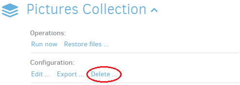

In the _Delete backup_ screen, you can choose to keep or delete the local database associated with the selected backup job. Default setting is to delete the local database, because it is no longer needed if the backup job no longer exist. In addition to that, the database can be rebuilt from using the files at the backend.

Before deleting a backup job, it is recommended to export the backup job settings to a file. The _Export configuration_ button is a quick link to this function. More about exporting backup configuration can be found in [Exporting a backup job configuration](03-using-the-graphical-user-interface/#exporting-a-backup-job-configuration).

If you no longer need the backup files themselves, Duplicati can delete these files from the backend, freeing up remote storage space.

*****
>  This is an irreversible process. If your storage provider does not support previous versions or something similar, restoring files from this backup set will be impossible.

*****

If you really want to delete the backup files also, click to select _Delete remote files_.

You can start the deletion with the _Delete backup_ button. If you chose to delete the remote files, you first have to fill in a captcha for security reasons.

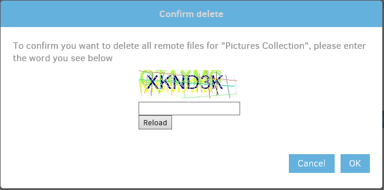

Confirm your choices by clicking _Yes_.

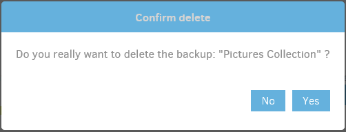

The backup job is removed from your Duplicati installation.


## Database management

Duplicati makes use of a local database for each backup job that contains information about what is stored at the backend. Main reasons for storing this information locally are performance and reduction of bandwidth usage. Without this database, Duplicati would need to download a fair amount of data from the backend for any operation.

 If a local database is available, it will be used during restore operations. However, the database is not required. In disaster recovery scenarios where the computer holding the source files is lost, a local database is not available. Requiring this database would make the backup file useless, so Duplicati is designed such that the local database can be rebuilt if it isn?t available.

If something happens to the local database, some maintenance tasks can be performed. During a backup operation, Duplicati could find some inconsistencies in the database and will request to do a database repair. You can perform maintenance tasks to the database by clicking the backup name and click _Database ..._ under _Advanced_.

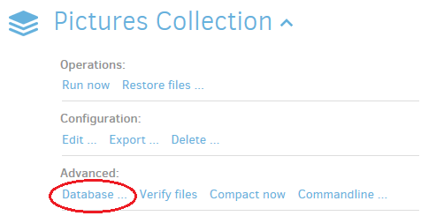

You have several options in the screen that appears.

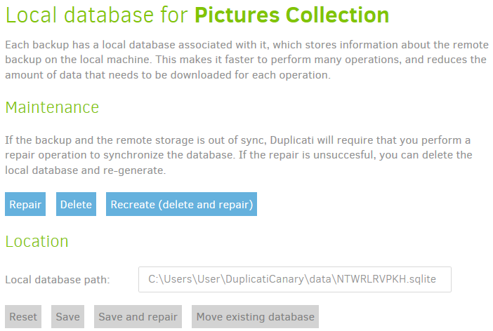

Clicking the Repair button will search the database for inconsistencies and repair them automatically for you.

If a database if corrupted heavily, or if repairing doesn't help, you can try to delete it. During the next backup job, the database will be rebuilt.

If you want to rebuild the database immediately, you can click the Recreate button, which will also delete the database, but starts the rebuild process immediately.

If you want to make changes to the location where the local database is stored, you can use the Reset, Save, Save and repair and Move existing database buttons.

First type in a new path and/or filename. Clicking Reset will undo changes you made to the Local database path. Save will store the new database location (you have to copy it manually to that location). Save and repair will do the same, but additionally initiate a repair operation on the database. Move existing database will move the database from the current location to the location specified in the Local database path text field.

## Verifying backend files

At the end of each backup job, Duplicati checks the integrity by downloading a few files from the backend. The contents of these file is checked against what Duplicati expects it to be. This procedure increases the reliability of the backup files, but backups take a bit longer to complete and use some download bandwidth.

Automatic verification after backup completion can be disabled by setting an advanced option. Howver, checking the integrity of the backup files is very important. If you disabled automatic verification, or if you just want to perform an additional verification, click the backup name and click Verify files under Advanced.

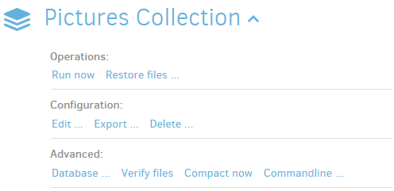

The Verify operation starts immediately after clicking _Verify files_.

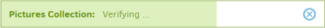

If any errors or warnings occur, they will be displayed in a popup at the bottom of the Duplicati screen.

## Compacting files at the backend

After each backup operation, old backups are marked for removal. Which backups are considered old, can be configured in the Add backup wizard in Step 5\. Under General options you can specify how many backups you want to keep, or after how many days backups can be deleted.

Upload volumes (files at the backend) likely contain blocks that do belong old backups only, as well as blocks that are used by newer backups. Because the contents of these volumes are partly needed, they cannot be deleted, resulting in unnecessary allocated storage capacity.

The compacting process takes care of this. When a predefined percentage of a volume is used by obsolete backups, the volume is downloaded, old blocks are removed and bocks that are still in use are recompressed an re-encrypted. The smaller volume without obsolete contents is uploaded and the original volume is deleted, freeing up storage capacity at the backend.

Compacting can result in a lot of small volumes at the backend. If enough small files exist that can be combined to one or more volumes of the defined volume size (default 50 MB), these small volumes are downloaded, repackaged and uploaded to the backend, replacing these small files.

The compacting procedure is triggered after each backup, but can be disabled with an advanced option. If you want to perform a compacting operation manually, click on the backup name and click _Compact now_ under _Advanced_.

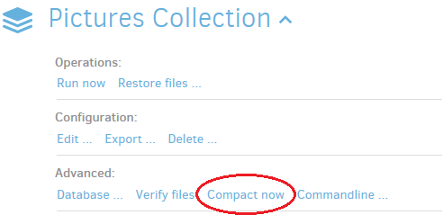

The compacting procedure starts immediately.


Depending on the amount of obsolete data, this can take some time. If no unused blocks are found, the task stops almost instantly.

## Using the Command line tools from within the Graphical User Interface

Some tasks you can perform from the command line are not yet implemented in the Graphical user interface, for example retrieving a list of backed up files, deleting one or more backups, purging files from all backup sets or comparing 2 backups and listing the differences.

*****
>  If you want to use the command line tools, some basic knowledge of how these tools work is required. Improper use of the Commandline tools may damage or delete your backup files.

*****

To open a command line screen, click the backup name and click _Commandline ..._ under _Advanced_.

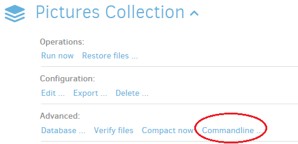

In the Commandline screen you can specify a number of options in a few sections:

In the _Command_ section, you ocan choose which command line tool you actualle want to use. You can choose from _send-mail_, _systeminfo_, _vacuum_, _affected_, _test-filters_, _verify_, _test_, _compare_, _create-report_, _compact_, _purge-broken-files_, _list-broken-files_, _purge_, _repair_, _restore_, _backup_, _delete_, _list_, _find_, _examples_ and _help_.


The Target URL section is already filled in with the URL and credentials that are used by the currently selected backup job. If you want to make changes to it, you can type them in the text box or click the _Target URL_ link.


Most command line tools need one or more commandline arguments. For example, if you want to delete a specific backup, you have to supply a version number to the Delete command. The default value for this field are the source folders selected for backup, but in most situations you have to change this.

*****
>  All commandline arguments must be entered at separate lines.

*****


All other options that are set for the current backup job are listed under _Advanced options_. Options that do not affect the current backup command can be ignored. Conflicting options in the list can be deleted by clicking the blue X at the right side of each advanced option. The _Edit as text_ link lists all advanced options in a text box, making it easy to delete or modify multiple options.

**Example 1**: Retrieving a list of all files that can be restored from the latest backup.

You need the FIND command to list files in a particular backup. The FIND command expects a file mask to filter the list of found files as an argument. If you want a complete list, replace the contents of the _Commandline arguments_ text box with an asterisk (*). Keep the Target URL unchanged. The upper part of the Commandline screen should look something like this:


Click the _Run "find" command now_ button. The results are listed in the Duplicati main screen.


**Example 2**: Find the differences between 2 backups.

The COMPARE command lists differences between 2 backups. Choose _compare_ in the _Command_ pull-down menu. Leave the Target URL unchanged and enter the base version number and the version number to compare at separate lines.


Additional options can be typed in the Commandline arguments text box, or added to the Advanced options list. When using the Advanced option list, open the _Add advanced option_ pull-down menu and choose the option you want to add, for example _verbose_. To enable this option, place a checkmark behind it in the list or remove the checkmark to disable verbose mode. Alternatively, you can add `--verbose=true` to a new line in the _Commandline arguments_ text box.

The `--verbose` option will list all new, modified and deleted files and folders. Without this options, only the totals and the first 10 files will be listed. The results (without the `--verbose` option) looks like this:


## Viewing the log files of a backup job

You can view all messages and results related to backup job operations . To view these log entries, click the backup name and click _Show log ..._ under _Reporting_.


The log data for the selected backup job is displayed. You can choose to view the general events or the events that are specific to backend operations, by clicking the _General_ or _Remote_ button.


In the General log, a list is presented with timestamps, followed by _Result_ or _Message_. Click on a line to expand it and view the details of the result or message.

_Result_ contains statistics, warning and error messages, in case they happened. _Message_ lines contain individual messages that were generated during a particular operation.

## Creating a bug report

In case you need technical support, the Duplicati development team could ask for a bug report. A bug report contains information about the system Duplicati is installed on, some information about the Duplicati installation itself and an obfuscated version of the local databases, without the original foldernames and filenames of your local storage.

To create a bug report, click the backup name and click _Create bug report ..._ under _Reporting_.


The creation of the bug report starts immediately.


When completed, a message is displayed and you can download the generated report.


Click the Download button and send the report to the Duplicati development team for further investigation.

## Settings in Duplicati

In the _Settings_ menu you can specify different types of settings. In the first place there are some general program settings. These settings influence the look and feel of the user interface and determine the way that the software is started and updated.

Additionally you can define a list of default settings that apply to all backup jobs that don't have explicitly defined that settings.

Access to user interface


Click to check the _Password_ checkbox to secure the web interface with a password. Type a strong password in the text field. Click the OK button to confirm your setting. Next time you access the web interface you have to type the password to access the Duplicati web interface.

When enabled, _Allow remote access_ allows access to the web interface from other hosts in the network.

*****
>  If you are using a firewall, don?t forget to make an access rule in your firewall to allow incoming traffic using the port the Duplicati sever listens on (default port is TCP port 8200).

*****

*****
>  When allowing remote access, setting a password to the user interface is highly recommended. Anonymous access to Duplicati will give anybody access to your personal files.

*****

*****
>  If Duplicati is registered as a Windows service, setting a password to the user interface is highly recommended. If the Duplicati service is started using the SYSTEM account, anyone with access to the user interface will have access to the complete file system of the local host. Don?t allow remote access when running Duplicati as a service, unless strictly needed.

*****

You can set a delay for Duplicati to become active after startup or hibernation. When Duplicati is started, no tasks will be performed until the specified time has elapsed.</span></span>


With the User Interface settings you can change the interface language and choose a color scheme.


You can disable donation messages, for example if you already made a donation. Toggle donation messages by clicking on the link.


If you have installed a beta version of Duplicati, your installation is classified in the Beta Update Channel, which means that you will get an update notification when a new beta version is available. You can change the update channel by selecting your preferred type of Duplicati builds.


Duplicati can send anonymous reports containing information about how you use Duplicati. These reports can be viewed at [https://usage-reporter.duplicati.com/](https://usage-reporter.duplicati.com/).

You can set the level of reports to be sent (Information, Warning, Error or None). Setting this to _None_ will disable reporting usage statistics at all.


In the Settings screen, you can generate a list of advanced options. These options will be applied to all backup jobs, unless the same options with another value are specified in a particular backup job configuration. This avoids having to set the same settings for each backup job you create. For example, if you want to send an email after each backup operation, you can set this, including mail server settings and credentials, in the _Default options_ list.


To add a default option, open the pull-down menu by clicking _pick an option_. A long list is displayed. Find the option you want to set as default option, for example `send-mail level`. The option is added to the list and you can set the value. Type _all_ to send an email regardless of the result (successful, warning, error or fatal). The same way you can add an email recipient by selecting the `send-mail-to` option from the list. Type the email address you want to send the email to. After the options are added, you should have this list:


All backup jobs should send a mail to the specified email address after completion. If there is a backup job that should send the email to another address, you only have to specify the alternative email address using advanced option send-mail-to in the backup job configuration. Advanced option `send-mail-level` is already configured in the _Default options_.

## Viewing the Duplicati Server Logs

All operations that are performed by the Duplicati server component are stored in the internal log. To view it, click _Show log_ in the main menu. All stored events are listed, including date and time. Clicking on an event shows detailed information about it.

If you want to see what is happening in the background in real time, click the _Live_ button. This is disabled by default to preserve system resources. Choose one of the levels _Error_, _Warning_, _Information_ or _Profiling_. _Error_ will only display events indicating that something goes wrong, _Profiling_ lists about every single event that occurs. Clicking on an event also reveals detailed information about that event.

## Getting information about your setup

If you want more information about the Duplicati version that is installed on your system, or about the system itself Duplicati is running on, click _About_ in the main menu. The _About_ screen consists of four overviews. Each overview can be displayed using the four buttons.


_General_ will show information about Duplicati and the version you work with. You can check for updates using the _Check for updates now_ link in this overview. If a new version for your update channel is available, a message will be displayed with the new version number. Use the _Download_ and _Activate_ buttons to update your Duplicati installation to the latest version.

In the _Changelog_ overview you can see what's changed in the software up to the installed version.

The _Libraries_ button shows all third party components that were used in the Duplicati software package, including a link to the website and a link to licensing information for that component.

_System info_ displays information about the system Duplicati is installed on.

## Updating Duplicati

Duplicati checks for new updates regularly. When a new update in your update channel is available, Duplicati will notify you about this update by displaying a message at the bottom of the main screen. You can check for updates immediately by clicking _Check for updates now_ in the _General_ overview of the _About_ screen.

Installing updates is as simple as downloading and activating the new version by using the buttons in the message.

