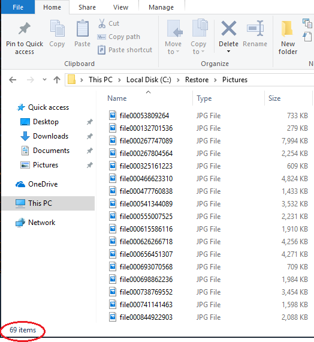

## Definition of a disaster

This chapter describes how to recover from a disaster. Before we continue, we first have to define what a disaster actually is. Two categories can be distinguished:

* Loss or corruption of source files or the complete source system.
* Missing or corrupted backup files.

How to restore files to the original location of the same system and how to restore files from a consistent backup to a new computer is described in [Restoring files from a backup](../03-using-the-graphical-user-interface/#restoring-files-from-a-backup) and [Restoring files if your Duplicati installation is lost](../03-using-the-graphical-user-interface/#restoring-files-if-your-duplicati-installation-is-lost).

This chapter describes the process of restoring as much as possible from a backup that is inconsistent due to corrupted or missing files at the backend, without access to the source files and the Duplicati setup.

Usually you can install Duplicati on any computer and point to the location that contains your backup to restore files. Duplicati will try to automatically recover from problems it finds, but is there is significant damage in your backup files, the restore process may fail, resulting in aborting the restore operation, leaving files unrecovered that are potentially restorable. In this situation you can use the `Duplicati.CommandLine.RecoveryTool.exe` to restore files that are not affected by the backup corruption. You can use this tool to perform the operations manually that are normally done automatically by the standard tools.

## Test scenario

To explain the working of the `Duplicati.CommandLine.RecoveryTool.exe`, this setup is assumed:

The computer that contained the source files had 4 backup versions of the My Pictures folder. This computer, including Duplicati installation and picture files are assumed to be lost.

The backup location is an FTP server. The default Upload Volume size of 50MB is decreased to 10MB, resulting in more, but smaller files, which makes more sense for this example. After 4 backup operations, the files at the backend look like this:

```nohighlight
10,453,901  duplicati-b69a2a32a50bb4c6d8780389efdbf7442.dblock.zip.aes
     8,173  duplicati-i84de11dd9a334727a080a3cdedc11f76.dindex.zip.aes
10,409,309  duplicati-bb1e603b91cae420787ed855d40e7cc04.dblock.zip.aes
     9,677  duplicati-i77fdd0fa598d49fa93c5fedf3dbf4003.dindex.zip.aes
10,408,733  duplicati-b8fd38dcd303c4bcdb65dc15611f9b13b.dblock.zip.aes
     8,317  duplicati-id6042b5ed9c34faa86e41fd3bcff72d2.dindex.zip.aes
10,465,421  duplicati-bb1c167fdb8ef46e6a83fe1d5b8b33cbf.dblock.zip.aes
     6,765  duplicati-i1070213c1cea4844b3ace60c305854de.dindex.zip.aes
10,484,045  duplicati-b2b4fb88d1edd4eccade6b0ea6fdbfcf3.dblock.zip.aes
    11,341  duplicati-i0c85219ca5764fb183b4306e65ed2034.dindex.zip.aes
10,472,541  duplicati-bc70688944c1b4875b7561e8046dd582d.dblock.zip.aes
     8,301  duplicati-i726df1085487421b98bf9786e40d045f.dindex.zip.aes
10,384,701  duplicati-bf43697c750e746aead28ceb71af19359.dblock.zip.aes
     9,101  duplicati-ie084e3c9380847a8a01acefcb8245fe3.dindex.zip.aes
10,392,317  duplicati-bf797fdce00794d0dbeb31de1f3867240.dblock.zip.aes
     7,501  duplicati-i91b0156c9ced43bda26b6cef88f969b3.dindex.zip.aes
 1,754,637  duplicati-b13a41763d40e4001911fd6f5d5d6c53d.dblock.zip.aes
     3,709  duplicati-id79f5ccc6cb54f5faa7bbcf72c8e7428.dindex.zip.aes
     5,133  duplicati-20171109T100606Z.dlist.zip.aes
10,415,597  duplicati-bb4cb32561132426eba2e190089585362.dblock.zip.aes
     8,125  duplicati-ifd7c3d7bed47403197515b40821075fc.dindex.zip.aes
10,433,469  duplicati-b385c55aa15bd403e9fcb5a321339e76a.dblock.zip.aes
     6,909  duplicati-i59e5c4064b3d422995200772bd267645.dindex.zip.aes
10,447,373  duplicati-b4e0bcd6b8c0b4d648a97e53c32550cce.dblock.zip.aes
     8,829  duplicati-i21d3fcafc53b42bfa0dfe4cfdcc6a0d9.dindex.zip.aes
10,425,485  duplicati-b34811487cc1843e289ac577b6a7a8533.dblock.zip.aes
     8,093  duplicati-i92dcf425b2d14c8780c2938f84e2bc2c.dindex.zip.aes
 8,052,173  duplicati-bc385594379874159b0863dca12818ac7.dblock.zip.aes
     8,621  duplicati-ib02c8a76143440b99ec94773a7b00c90.dindex.zip.aes
     6,829  duplicati-20171109T100653Z.dlist.zip.aes
10,397,085  duplicati-b836b265755ff41ae908ef64e551ec63b.dblock.zip.aes
     8,717  duplicati-i0903704f50ec4277a0cb6e224bde49cb.dindex.zip.aes
10,404,509  duplicati-bc230fc2ccec54a33b2035fcbc0231ce4.dblock.zip.aes
     7,741  duplicati-i53b454d535de49e1983364b97bd681a1.dindex.zip.aes
10,463,597  duplicati-b54b864868bf341bcb88bff9ad786b8a3.dblock.zip.aes
     4,365  duplicati-id1e3d59e5e3e48f59a6fbd7f46b4bb8c.dindex.zip.aes
10,413,933  duplicati-b2b06934c5d764025a6965f1749d86a90.dblock.zip.aes
    11,421  duplicati-ifd2b08eaf75b43748739c5a140cb1267.dindex.zip.aes
10,468,957  duplicati-b5f8cd40e22a54b5b988689370b8cde34.dblock.zip.aes
     6,749  duplicati-ib9a135574fa84222beea313ac583463b.dindex.zip.aes
10,383,805  duplicati-bfa5ecd54953f455496a67b089e2ad35b.dblock.zip.aes
    10,301  duplicati-i19aa26f9c15e432ea5114c93acd52661.dindex.zip.aes
 4,505,165  duplicati-bd14cf57e975040808ac8d0f4bd9d5e36.dblock.zip.aes
     4,797  duplicati-id08a17cbe0a04407b4be37d2c48e8ab9.dindex.zip.aes
     8,749  duplicati-20171109T100737Z.dlist.zip.aes
10,483,357  duplicati-be6e935d55f0b443b8c716c83aebccb93.dblock.zip.aes
     9,885  duplicati-ic209185103c045bb87a680e98b78269b.dindex.zip.aes
   974,909  duplicati-b7fa18a6f863a42fea5f210cc5f1416e5.dblock.zip.aes
     2,125  duplicati-i57ce5109be6c4441998fc2bfb2cd0f3a.dindex.zip.aes
     9,901  duplicati-20171109T100815Z.dlist.zip.aes
```

There is one .dlist file for each backup version. The data itself is stored in a number of .dblock files. Each .dblock file has an accompanying .dindex file. This is a consistent backup, but in this test scenario, some files intentionally are corrupted by replacing the contents with random data and by removing a .dblock file.

## Inventory of files that are going to be corrupted

Prior to corrupting the consistent backup, we can inventory what the consequences are if these files get lost. You can use the Duplicati command `affected` to see which files are affected by a remote file. The `affected` command needs the local database, so you can perform this operation only if you have a fully working Duplicati installation for this backup job. See [The AFFECTED command](04-using-duplicati-from-the-command-line/#the-affected-command) for more information.

The first command returns which source files need information from the remote file `duplicati-b69a2a32a50bb4c6d8780389efdbf7442.dblock.zip.aes`.

```nohighlight
Duplicati.CommandLine.exe affected "ftp://myftpserver.com/Backup/Pictures?auth-username=Duplicati&auth-password=backup" duplicati-b69a2a32a50bb4c6d8780389efdbf7442.dblock.zip.aes --dbpath="C:\Users\User\DuplicatiCanary\data\WCHNJBICGG.sqlite" --full-result
```

This command will return that all 4 backup versions need data from this file. These files are affected:

```nohighlight
C:\Users\User\Pictures\file0001079221497.jpg  
C:\Users\User\Pictures\file0001116000079.jpg  
C:\Users\User\Pictures\file0001141038889.jpg  
C:\Users\User\Pictures\file0001176452626.jpg
```

The second command returns affected backup versions and source files for remote file `duplicati-b5f8cd40e22a54b5b988689370b8cde34.dblock.zip.aes`:

```nohighlight
Duplicati.CommandLine.exe affected "ftp://myftpserver.com/Backup/Pictures?auth-username=Duplicati&auth-password=backup" duplicati-b5f8cd40e22a54b5b988689370b8cde34.dblock.zip.aes --dbpath="C:\Users\User\DuplicatiCanary\data\WCHNJBICGG.sqlite" --full-result</span></span>
```

Only the last 2 backup versions are affected (version 0 and 1), These 2 files cannot be restored if this remote file is missing or corrupted:

```nohighlight
C:\Users\User\Pictures\file451264266022.jpg  
C:\Users\User\Pictures\file621250696198.jpg
```

**Conclusion:** if the 2 remote files mentioned above are not available, the 6 picture files should be considered lost, but with the Duplicati Recoverytool all other files in the backup should be recoverable.

## Making the backup inconsistent

This is, of course, something that **never** should be done in a production environment, but for this test scenario we will intentionally damage the backup set, making it unusable for standard backup- and restore operations.

The following actions are performed on the backend:

* File `duplicati-b69a2a32a50bb4c6d8780389efdbf7442.dblock.zip.aes` is deleted.
* File `duplicati-b5f8cd40e22a54b5b988689370b8cde34.dblock.zip.aes` is replaced by a file with the same name containing random data.

Restoring files from this corrupted backup set will fail before the first file is actually restored. You can recover from this situation by using one of these procedures:

* Recovering by purging unrestorable files from the backups.
* Recovering by using the Duplicati Recovery Tool.

## Prerequisites for recovery

To be able to restore files in these scenarios, you will need:

* The protocol, location and credentials of the remote location where your backup files are stored.
* The passphrase used to encrypt your backup (if any).
* A computer that you can use for restoring data with enough free storage capacity for all files you want to restore
* The Duplicati Command Line tools. These tools are part of a standard Duplicati setup.
* If you are using the Duplicati Recovery Tool: temporary local storage with enough free space to store all backup files.

## Recovering by purging files

If you still have access to your computer running Duplicati and the backup job has a valid local database, Duplicati can analyze the files that should be in the backup and compare this what's actually at the remote location. Use the Duplicati command `list-broken-files` to list files that cannot be restored due to corruption or missing data. The command `purge-broken-files` actually deletes these files from all backup versions.

To get an impression of the damage to the backup set, run this command:

```nohighlight
Duplicati.CommandLine.exe list-broken-files "ftp://myftpserver.com/Backup/Pictures?auth-username=Duplicati&auth-password=backup" --dbpath="C:\Users\User\DuplicatiCanary\data\WCHNJBICGG.sqlite" --passphrase="4u7P_re5&+Gb>6NO{" --full-result
```

The result is:

```nohighlight
No broken filesets found in database, checking for missing remote files
  Listing remote folder ...
remote file duplicati-b5f8cd40e22a54b5b988689370b8cde34.dblock.zip.aes is listed as Verified with size 9569280 but should be 10468957, please verify the sha256 hash "hIPABrSE/6xN041ut6IKb0sUSMxYGRI3ZqAWwY+q6JM="
Marked 1 remote files for deletion
3       : 11/9/2017 11:06:06 AM (5 match(es))
        C:\Users\User\Pictures\file0001079221497.jpg (4.89 MB)
        C:\Users\User\Pictures\file0001116000079.jpg (302.49 KB)
        C:\Users\User\Pictures\file0001141038889.jpg (3.50 MB)
        C:\Users\User\Pictures\file0001176452626.jpg (1.65 MB)
2       : 11/9/2017 11:06:53 AM (4 match(es))
        C:\Users\User\Pictures\file0001079221497.jpg (4.89 MB)
        C:\Users\User\Pictures\file0001116000079.jpg (302.49 KB)
        C:\Users\User\Pictures\file0001141038889.jpg (3.50 MB)
        C:\Users\User\Pictures\file0001176452626.jpg (1.65 MB)
1       : 11/9/2017 11:07:37 AM (4 match(es))
        C:\Users\User\Pictures\file0001079221497.jpg (4.89 MB)
        C:\Users\User\Pictures\file0001116000079.jpg (302.49 KB)
        C:\Users\User\Pictures\file0001141038889.jpg (3.50 MB)
        C:\Users\User\Pictures\file0001176452626.jpg (1.65 MB)
0       : 11/9/2017 11:08:15 AM (4 match(es))
        C:\Users\User\Pictures\file0001079221497.jpg (4.89 MB)
        C:\Users\User\Pictures\file0001116000079.jpg (302.49 KB)
        C:\Users\User\Pictures\file0001141038889.jpg (3.50 MB)
        C:\Users\User\Pictures\file0001176452626.jpg (1.65 MB)
```


The 4 files from the deleted .dblock file are detected to be broken. Also detected is a change to the .dblock file that contains the other 2 files.

First we solve the problem with the deleted remote .dblock file by using the `purge-broken-files` command.

*****
 >  Add advanced option `--dry-run` to the command below to see what the command will do, before actually purging the files from the backups.

*****

```nohighlight
Duplicati.CommandLine.exe purge-broken-files "ftp://myftpserver.com/Backup/Pictures?auth-username=Duplicati&auth-password=backup" --dbpath="C:\Users\User\DuplicatiCanary\data\WCHNJBICGG.sqlite" --passphrase="4u7P_re5&+Gb>6NO{" --full-result
```

The purge-broken-files command returns this information:

```nohighlight
No broken filesets found in database, checking for missing remote files
  Listing remote folder ...
remote file duplicati-b5f8cd40e22a54b5b988689370b8cde34.dblock.zip.aes is listed as Verified with size 9569280 but should be 10468957, please verify the sha256 hash "hIPABrSE/6xN041ut6IKb0sUSMxYGRI3ZqAWwY+q6JM="
Marked 1 remote files for deletion
Found 4 broken filesets with 17 affected files, purging files
Purging 5 file(s) from fileset 11/9/2017 11:06:06 AM
Starting purge operation
Replacing fileset duplicati-20171109T100606Z.dlist.zip.aes with duplicati-20171109T100607Z.dlist.zip.aes which has with 5 fewer file(s) (10.33 MB reduction)
  Uploading file (4.47 KB) ...
  Deleting file duplicati-20171109T100606Z.dlist.zip.aes ...
Purging 4 file(s) from fileset 11/9/2017 11:06:53 AM
Starting purge operation
Replacing fileset duplicati-20171109T100653Z.dlist.zip.aes with duplicati-20171109T100654Z.dlist.zip.aes which has with 4 fewer file(s) (10.33 MB reduction)
  Uploading file (6.22 KB) ...
  Deleting file duplicati-20171109T100653Z.dlist.zip.aes ...
Purging 4 file(s) from fileset 11/9/2017 11:07:37 AM
Starting purge operation
Replacing fileset duplicati-20171109T100737Z.dlist.zip.aes with duplicati-20171109T100738Z.dlist.zip.aes which has with 4 fewer file(s) (10.33 MB reduction)
  Uploading file (8.09 KB) ...
  Deleting file duplicati-20171109T100737Z.dlist.zip.aes ...
Purging 4 file(s) from fileset 11/9/2017 11:08:15 AM
Starting purge operation
Replacing fileset duplicati-20171109T100815Z.dlist.zip.aes with duplicati-20171109T100816Z.dlist.zip.aes which has with 4 fewer file(s) (10.33 MB reduction)
  Uploading file (9.22 KB) ...
  Deleting file duplicati-20171109T100815Z.dlist.zip.aes ...
  Deleting file duplicati-b69a2a32a50bb4c6d8780389efdbf7442.dblock.zip.aes (9.97 MB) ...
Operation Delete with file duplicati-b69a2a32a50bb4c6d8780389efdbf7442.dblock.zip.aes attempt 1 of 5 failed with message: The remote server returned an error: (550) File unavailable (e.g., file not found, no access). => The remote server returned an error: (550) File unavailable (e.g., file not found, no access).
```

Some information from the messages above:

* `duplicati-b5f8cd40e22a54b5b988689370b8cde34.dblock.zip.aes` is corrupted and marked for deletion.
* Files that cannot be restored are deleted from all backup versions that contain these files (17 total). Note that this are not 17 unique source files, one file is usually included in multiple backup versions.
* New, consistent backup files are generated and uploaded to the backend.

## Recovering by using the Duplicati Recovery tool

The Duplicati Recovery tool allows to perform actions manually that are normally done automatically when running backup or restore operations. A normal restore consists of the following operatrions:

* Duplicati determines which remote files are needed to restore the specified files.
* Duplicati downloads the first required remote file.
* The file is decrypted using the supplied passphrase.
* Duplicati uses the .DINDEX files to determine how files can be recreated by merging blocks inside .DBLOCK files in the correct order.
* The recreated files are moved to the supplied Restore location.

The Duplicati Recovery Tool can perform these actions step by step, giving you more control over each step in the restore process.

In disaster recovery scenarios, the Duplicati Recovery Tool performs 3 steps:

* All remote files are downloaded from the backend, decrypted and stored in the local filesystem.
* An index is built that allows Duplicati to keep track of what information is stored in which file.
* Files are restored from the downloaded backend files by recreating them using the blocks inside the .DBLOCK files.

Optionally, these additional actions can be performed:

* List files that are available in the downloaded remote files.
* Recompress and/or re-upload files to the backend. This is useful if you want to change the compression type of an existing backup job. Changing the compression type (.7z to .zip) is not supported, but you can do this by downloading the complete backup, decrypt all files, extract all files, recompress the files using another compression type, re-encrypt the files and re-upload them to the backend. Additionally edit the backup configuration to use the new compression type for future backups.

## Downloading all remote files using the Recovery Tool

The first step is downloading all files that are used by the backup job. This step is required, because a lot of read/write operations have to be performed to the remote files. All files must be decrypted and the contents of all files must be read to analyze the contents.

Remote files can be downloaded using the `download` command:

`Duplicati.RecoveryTool.exe download <remoteurl> <localfolder> [options]`

This command fill download all remote files from `<remoteurl>`, decrypt the files and store the decrypted files in `<localfolder>`.

Required information:

* **Storage type**  
In this example the backup is stored using FTP, but all storage types are supported. See [Storage Providers](05-storage-providers) for more information.
* **Address, path and credentials to access the remote files**  
In this example the address is `myftpserver.com`, the path is `/Backup/Pictures`, the FTP username is `duplicati` and the FTP password is `backup`.
* **The passphrase used to encrypt the backup**  
In this example the passphrase `4u7P_re5&+Gb>6NO{` was used for the backup.
* **Optional advanced options for access to the remote files**  
If you applied any options that are needed to get access to the backend files, supply these options here. See [Storage Providers](05-storage-providers) for more information.

*****
>  Store information about your backup configuration (storage provider, storage location, credentials and passphrase) on a safe location that is also available when your computer Duplicati is lost. Without this information, your backup files are useless, because the passphrase is the only way to decrypt the files in your backup.

*****

Create an empty folder in your local filesystem, for example `C:\BackendFiles`. Be sure that the location you download the backup files to has enough free space to store **all** backup files.

*****
>  If you are unsure about the required free space, verify how many space is used by all files with a filename that start with duplicati- (or any prefix you specified in the backup job with the --prefix option). If still unsure, use an empty external disk with enough capacity. You have to start over the complete download process if free space runs out when downloading files.

*****

This command downloads and decrypts all backup files and stores these files in `C:\BackendFiles`:

```nohighlight
Duplicati.CommandLine.RecoveryTool.exe download "ftp://myftpserver.com/Backup/Pictures?auth-username=duplicati&auth-password=backup" C:\BackendFiles --passphrase="4u7P_re5&+Gb>6NO{"
```

The output is something like this:

```nohighlight
Listing files on backend: ftp ...
Found 49 files
0: duplicati-20171109T100606Z.dlist.zip.aes - downloading (5.01 KB)... - decrypting ... done!
1: duplicati-20171109T100653Z.dlist.zip.aes - downloading (6.67 KB)... - decrypting ... done!
2: duplicati-20171109T100737Z.dlist.zip.aes - downloading (8.54 KB)... - decrypting ... done!
3: duplicati-20171109T100815Z.dlist.zip.aes - downloading (9.67 KB)... - decrypting ... done!
4: duplicati-b13a41763d40e4001911fd6f5d5d6c53d.dblock.zip.aes - downloading (1.67 MB)... - decrypting ... done!
5: duplicati-b2b06934c5d764025a6965f1749d86a90.dblock.zip.aes - downloading (9.93 MB)... - decrypting ... done!
6: duplicati-b2b4fb88d1edd4eccade6b0ea6fdbfcf3.dblock.zip.aes - downloading (10.00 MB)... - decrypting ... done!
7: duplicati-b34811487cc1843e289ac577b6a7a8533.dblock.zip.aes - downloading (9.94 MB)... - decrypting ... done!
8: duplicati-b385c55aa15bd403e9fcb5a321339e76a.dblock.zip.aes - downloading (9.95 MB)... - decrypting ... done!
9: duplicati-b4e0bcd6b8c0b4d648a97e53c32550cce.dblock.zip.aes - downloading (9.96 MB)... - decrypting ... done!
10: duplicati-b54b864868bf341bcb88bff9ad786b8a3.dblock.zip.aes - downloading (9.98 MB)... - decrypting ... done!
11: duplicati-b5f8cd40e22a54b5b988689370b8cde34.dblock.zip.aes - downloading (9.13 MB)... - decrypting ... error: 
System.IO.InvalidDataException: Invalid header marker
   at SharpAESCrypt.SharpAESCrypt.ReadEncryptionHeader(String password, Boolean skipFileSizeCheck)
   at SharpAESCrypt.SharpAESCrypt..ctor(String password, Stream stream, OperationMode mode, Boolean skipFileSizeCheck)
   at Duplicati.Library.Encryption.AESEncryption.Decrypt(Stream input)
   at Duplicati.Library.Encryption.EncryptionBase.Decrypt(Stream input, Stream output)
   at Duplicati.Library.Encryption.EncryptionBase.Decrypt(String inputfile, String outputfile)
   at Duplicati.CommandLine.RecoveryTool.Download.Run(List`1 args, Dictionary`2 options, IFilter filter)
12: duplicati-b7fa18a6f863a42fea5f210cc5f1416e5.dblock.zip.aes - downloading (952.06 KB)... - decrypting ... done!
13: duplicati-b836b265755ff41ae908ef64e551ec63b.dblock.zip.aes - downloading (9.92 MB)... - decrypting ... done!
14: duplicati-b8fd38dcd303c4bcdb65dc15611f9b13b.dblock.zip.aes - downloading (9.93 MB)... - decrypting ... done!
15: duplicati-bb1c167fdb8ef46e6a83fe1d5b8b33cbf.dblock.zip.aes - downloading (9.98 MB)... - decrypting ... done!
16: duplicati-bb1e603b91cae420787ed855d40e7cc04.dblock.zip.aes - downloading (9.93 MB)... - decrypting ... done!
17: duplicati-bb4cb32561132426eba2e190089585362.dblock.zip.aes - downloading (9.93 MB)... - decrypting ... done!
18: duplicati-bc230fc2ccec54a33b2035fcbc0231ce4.dblock.zip.aes - downloading (9.92 MB)... - decrypting ... done!
19: duplicati-bc385594379874159b0863dca12818ac7.dblock.zip.aes - downloading (7.68 MB)... - decrypting ... done!
20: duplicati-bc70688944c1b4875b7561e8046dd582d.dblock.zip.aes - downloading (9.99 MB)... - decrypting ... done!
21: duplicati-bd14cf57e975040808ac8d0f4bd9d5e36.dblock.zip.aes - downloading (4.30 MB)... - decrypting ... done!
22: duplicati-be6e935d55f0b443b8c716c83aebccb93.dblock.zip.aes - downloading (10.00 MB)... - decrypting ... done!
23: duplicati-bf43697c750e746aead28ceb71af19359.dblock.zip.aes - downloading (9.90 MB)... - decrypting ... done!
24: duplicati-bf797fdce00794d0dbeb31de1f3867240.dblock.zip.aes - downloading (9.91 MB)... - decrypting ... done!
25: duplicati-bfa5ecd54953f455496a67b089e2ad35b.dblock.zip.aes - downloading (9.90 MB)... - decrypting ... done!
26: duplicati-i0903704f50ec4277a0cb6e224bde49cb.dindex.zip.aes - Filetype Index, skipping
26: duplicati-i0c85219ca5764fb183b4306e65ed2034.dindex.zip.aes - Filetype Index, skipping
26: duplicati-i1070213c1cea4844b3ace60c305854de.dindex.zip.aes - Filetype Index, skipping
26: duplicati-i19aa26f9c15e432ea5114c93acd52661.dindex.zip.aes - Filetype Index, skipping
26: duplicati-i21d3fcafc53b42bfa0dfe4cfdcc6a0d9.dindex.zip.aes - Filetype Index, skipping
26: duplicati-i53b454d535de49e1983364b97bd681a1.dindex.zip.aes - Filetype Index, skipping
26: duplicati-i57ce5109be6c4441998fc2bfb2cd0f3a.dindex.zip.aes - Filetype Index, skipping
26: duplicati-i59e5c4064b3d422995200772bd267645.dindex.zip.aes - Filetype Index, skipping
26: duplicati-i726df1085487421b98bf9786e40d045f.dindex.zip.aes - Filetype Index, skipping
26: duplicati-i77fdd0fa598d49fa93c5fedf3dbf4003.dindex.zip.aes - Filetype Index, skipping
26: duplicati-i84de11dd9a334727a080a3cdedc11f76.dindex.zip.aes - Filetype Index, skipping
26: duplicati-i91b0156c9ced43bda26b6cef88f969b3.dindex.zip.aes - Filetype Index, skipping
26: duplicati-i92dcf425b2d14c8780c2938f84e2bc2c.dindex.zip.aes - Filetype Index, skipping
26: duplicati-ib02c8a76143440b99ec94773a7b00c90.dindex.zip.aes - Filetype Index, skipping
26: duplicati-ib9a135574fa84222beea313ac583463b.dindex.zip.aes - Filetype Index, skipping
26: duplicati-ic209185103c045bb87a680e98b78269b.dindex.zip.aes - Filetype Index, skipping
26: duplicati-id08a17cbe0a04407b4be37d2c48e8ab9.dindex.zip.aes - Filetype Index, skipping
26: duplicati-id1e3d59e5e3e48f59a6fbd7f46b4bb8c.dindex.zip.aes - Filetype Index, skipping
26: duplicati-id6042b5ed9c34faa86e41fd3bcff72d2.dindex.zip.aes - Filetype Index, skipping
26: duplicati-id79f5ccc6cb54f5faa7bbcf72c8e7428.dindex.zip.aes - Filetype Index, skipping
26: duplicati-ie084e3c9380847a8a01acefcb8245fe3.dindex.zip.aes - Filetype Index, skipping
26: duplicati-ifd2b08eaf75b43748739c5a140cb1267.dindex.zip.aes - Filetype Index, skipping
26: duplicati-ifd7c3d7bed47403197515b40821075fc.dindex.zip.aes - Filetype Index, skipping
Download complete, of 49 remote files, 0 were downloaded with 1 errors

```
In this example, 49 files were found at the backend. From all .DBLOCK files, 1 file was corrupt and could not be decrypted. Files with the .DINDEX extension are index files that will be recreated, therefore they are not downloaded. 4 .DLIST files were found and downloaded to `C:\BackendFiles`.

As a result, the `C:\BackendFiles` folder contains 25 unencrypted .Zip files: 4 `.dlist.zip` files and 21 `.dblock.zip` files.

## Creating an index of downloaded files using the Recovery Tool

When all files that contain applicable information are downloaded, an index file must be created. Without this index, we have nothing more than a bunch of files containing hashes and raw data. The index can be created with the Duplicati Recovery Tool using the `index` command:

`Duplicati.RecoveryTool.exe index <localfolder> [options]`

This command only requires the location of the local folder to be specified, in this example `C:\BackendFiles`. The index file will be created in the same folder. If you want the index file to be created in another folder, use advanced option `--indexfile` to specify the location. The Temporary files folder is used intensively by this process. Optionally you can specify a custom location with the `--tempdir` option.

To build an index of the files in C:\BackendFiles, use this command:

`Duplicati.CommandLine.RecoveryTool.exe index "C:\BackendFiles"`

The output is similar to this:

```nohighlight
Processing 26 files
0: C:\BackendFiles\duplicati-20171109T100606Z.dlist.zip - Filetype Files, skipping
0: C:\BackendFiles\duplicati-20171109T100653Z.dlist.zip - Filetype Files, skipping
0: C:\BackendFiles\duplicati-20171109T100737Z.dlist.zip - Filetype Files, skipping
0: C:\BackendFiles\duplicati-20171109T100815Z.dlist.zip - Filetype Files, skipping
0: C:\BackendFiles\duplicati-b13a41763d40e4001911fd6f5d5d6c53d.dblock.zip 21 hashes found, sorting ... done!
Merging 21 hashes ... done!
1: C:\BackendFiles\duplicati-b2b06934c5d764025a6965f1749d86a90.dblock.zip 111 hashes found, sorting ... done!
Merging 132 hashes ... done!
2: C:\BackendFiles\duplicati-b2b4fb88d1edd4eccade6b0ea6fdbfcf3.dblock.zip 116 hashes found, sorting ... done!
Merging 248 hashes ... done!
3: C:\BackendFiles\duplicati-b34811487cc1843e289ac577b6a7a8533.dblock.zip 113 hashes found, sorting ... done!
Merging 361 hashes ... done!
4: C:\BackendFiles\duplicati-b385c55aa15bd403e9fcb5a321339e76a.dblock.zip 109 hashes found, sorting ... done!
Merging 470 hashes ... done!
5: C:\BackendFiles\duplicati-b4e0bcd6b8c0b4d648a97e53c32550cce.dblock.zip 108 hashes found, sorting ... done!
Merging 578 hashes ... done!
6: C:\BackendFiles\duplicati-b54b864868bf341bcb88bff9ad786b8a3.dblock.zip 103 hashes found, sorting ... done!
Merging 681 hashes ... done!
7: C:\BackendFiles\duplicati-b7fa18a6f863a42fea5f210cc5f1416e5.dblock.zip 15 hashes found, sorting ... done!
Merging 696 hashes ... done!
8: C:\BackendFiles\duplicati-b836b265755ff41ae908ef64e551ec63b.dblock.zip 114 hashes found, sorting ... done!
Merging 810 hashes ... done!
9: C:\BackendFiles\duplicati-b8fd38dcd303c4bcdb65dc15611f9b13b.dblock.zip 109 hashes found, sorting ... done!
Merging 919 hashes ... done!
10: C:\BackendFiles\duplicati-bb1c167fdb8ef46e6a83fe1d5b8b33cbf.dblock.zip 111 hashes found, sorting ... done!
Merging 1030 hashes ... done!
11: C:\BackendFiles\duplicati-bb1e603b91cae420787ed855d40e7cc04.dblock.zip 120 hashes found, sorting ... done!
Merging 1150 hashes ... done!
12: C:\BackendFiles\duplicati-bb4cb32561132426eba2e190089585362.dblock.zip 108 hashes found, sorting ... done!
Merging 1258 hashes ... done!
13: C:\BackendFiles\duplicati-bc230fc2ccec54a33b2035fcbc0231ce4.dblock.zip 108 hashes found, sorting ... done!
Merging 1366 hashes ... done!
14: C:\BackendFiles\duplicati-bc385594379874159b0863dca12818ac7.dblock.zip 86 hashes found, sorting ... done!
Merging 1452 hashes ... done!
15: C:\BackendFiles\duplicati-bc70688944c1b4875b7561e8046dd582d.dblock.zip 114 hashes found, sorting ... done!
Merging 1566 hashes ... done!
16: C:\BackendFiles\duplicati-bd14cf57e975040808ac8d0f4bd9d5e36.dblock.zip 50 hashes found, sorting ... done!
Merging 1616 hashes ... done!
17: C:\BackendFiles\duplicati-be6e935d55f0b443b8c716c83aebccb93.dblock.zip 122 hashes found, sorting ... done!
Merging 1738 hashes ... done!
18: C:\BackendFiles\duplicati-bf43697c750e746aead28ceb71af19359.dblock.zip 112 hashes found, sorting ... done!
Merging 1850 hashes ... done!
19: C:\BackendFiles\duplicati-bf797fdce00794d0dbeb31de1f3867240.dblock.zip 110 hashes found, sorting ... done!
Merging 1960 hashes ... done!
20: C:\BackendFiles\duplicati-bfa5ecd54953f455496a67b089e2ad35b.dblock.zip 107 hashes found, sorting ... done!
Merging 2067 hashes ... done!
21: C:\BackendFiles\index.txt - Not a Duplicati file, ignoring
Processed 21 files and found 2067 hashes
``` 

The resulting index file index.txt contains a list of hashes and `.DBLOCK` filenames.

## List backup versions and files using the Recovery Tool

Before the actual restore operation is performed, you can see what is inside the downloaded and encrypted remote files. Use the Recovery Tool's `list` command to retrieve this information:

`Duplicati.RecoveryTool.exe list <localfolder> [version] [options]`

Without a version specified, all available backup versions are listed. When a version number is supplied, all restorable files from that backup version are listed. Try these commands:

`Duplicati.CommandLine.RecoveryTool.exe list C:\BackendFiles`

`Duplicati.CommandLine.RecoveryTool.exe list C:\BackendFiles 0`

## Restoring files using the Recovery Tool

After all backup files are downloaded, decrypted and indexed, you can start with the actual restore process. With the Duplicati Recovery Tool, use the`restore` command to restore all files that can be recovered from any backup version to the location of your choice:

`Duplicati.RecoveryTool.exe restore <localfolder> [version] [options]`

`<localfolder>` is a required option. It should point to the location where your downloaded remote files are stored. Optionally add `--targetpath` to specify where files must be restored to, otherwise the files are restored to their original locations. Use filters or the `--exclude` option to perform a partial restore. See [exclude](06-advanced-options/#exclude) and [APPENDIX D Filters](appendix-d-filters) for more information.

In this example, files are restored to `C:\Restore`, so an empty folder `C:\Restore` is created first.

This command will restore all files from the latest backup version (0) to `C:\Restore`:

`Duplicati.CommandLine.RecoveryTool.exe restore C:\BackendFiles 0 --targetpath="C:\Restore"`

The output starts with something similar to this:  

```nohighlight
Sorting index file ... done!  
Building lookup table for file hashes  
Index file has 2047 hashes in total  
Building lookup table with 2046 entries, giving increments of 1  
Computing restore path  
Restoring 75 files to C:\Restore  
Removing common prefix C:\Users\User\ from files
```

All restored files are listed. The list probably contains errors, because files that need data from corrupted blocks cannot be restored.

In this example, from a corrupted backup with one deleted dblock file and one corrupted dblock file, 69 of 75 picture files were recovered successfully.




