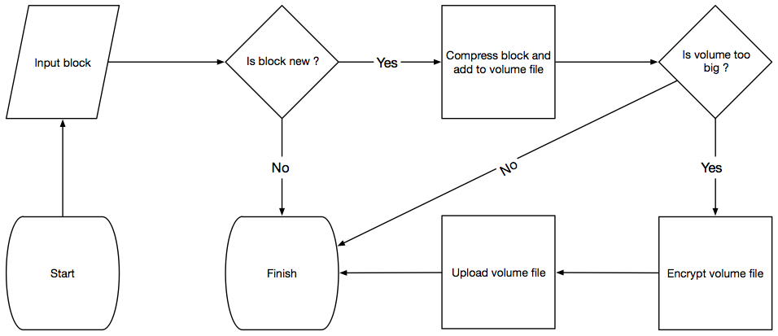
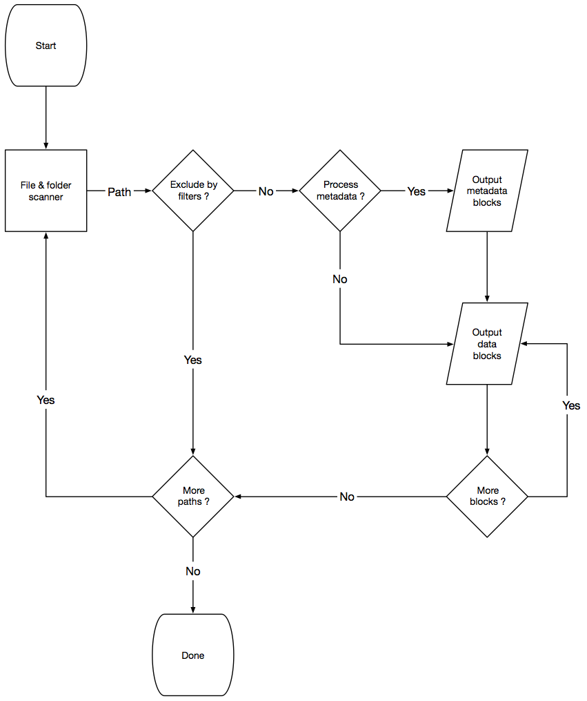

# How the backup process works

### Introduction

Duplicati is an open source backup application, that has no server-side components and thus it can support a wide variety of cloud-based storage providers. This also means, Duplicati has to handle large latencies, disconnects and it can only add and delete files but not modify existing files. Duplicati copes with it by using a storage format that merges small files and splits large files and that supports features like encryption, compression and de-duplication, versioning and incremental backups. In this article, we walk through the process of backing up a few files to a remote storage, to illustrate how it basically works.

### The source data

For this article, we will assume you want to make a backup of a small folder on a Windows machine, the content of that folder is:

```nohighlight
C:\data
|----> mydoc.txt, 4kb
|----> myvideo.mp4, 210kb
|----> extra
       |-----> olddoc.txt, 2kb
       |-----> samevideo.mp4, 210kb
       
```

### The backup process

Duplicati will always traverse the filesystem in "filesystem order", meaning whichever order the operating system returns the files and folders from a listing. This is usually the fastest way, as it relates to how the files are physically stored on the disk.

As Duplicati only works with absolute paths, it will see the following list:

```nohighlight
C:\data\
C:\data\mydoc.txt
C:\data\myvideo.mp4
C:\data\extra\
C:\data\extra\olddoc.txt
C:\data\extra\samevideo.mp4
```

For a real-world example, the list would be longer and would likely also have multiple filters, but for this example we omit these details.

To store the information about what is in the backup, Duplicati relies on standard file formats, and uses the JSON data format and Zip compression.

To store the file list, Duplicati creates a file named `duplicati-20161014090000.dlist.zip` locally, where the numbers represent the current date and time in the UTC timezone. Inside this zip archive is a single JSON file named `filelist.json`, which starts out by being an empty list, which is expressed in JSON as `[]`.

To store the data from files, Duplicati creates a file named `duplicati-7af781d3401eb90cd371.dblock.zip`, where the letters and numbers are chosen at random and have no relation to the data nor the current time. Initially this zip file is empty.

You can see an overview of the process here:

*****

*****

*****

*****

### Processing a folder

When Duplicati receives the first entry, `C:\data\`, it notices that the entry is a folder, and thus has no actual data, so it simply adds this entry to the `filelist.json` mentioned above, such that it now looks like:

```nohighlight
[
  {
  "type": "folder",
  "path": "C:\\data\\"
  }
]
```

In the actual implementation, it also stores metadata, such as permissions, modification times, etc, but we will omit those details here.

### Processing a small file

The next entry is `C:\data\mydoc.txt`, which is a file and thus has actual contents. Duplicati will read the file, a "block at a time", which is 100kb. As the file is only 4kb, it all "fits" inside a single block. Once the block is read, Duplicati computes a SHA-256 hash for that block and encodes the hash in Base64 encoding to get a string like `qaFXpxVTuYCuibb9P41VSeVn4pIaK8o3jUpJKqI4VF4=`. It then computes the SHA-256 hash for the entire file and also encodes that hash as Base64, but as the block and the file have the exact same contents (because in this case the whole file fits in a block), the resulting hash is the same: `qaFXpxVTuYCuibb9P41VSeVn4pIaK8o3jUpJKqI4VF4=`.

Note that no additional [salt](https://en.wikipedia.org/wiki/Salt_(cryptography)) is added to the hash. This is not required as the hash values are not visible after the zip volumes are encrypted, thus giving no hints for an attacker as to what the backup contains.

The contents of the mydoc.txt file (the 4kb) are then added to the `dblock` file mentioned above, using the string as the filename. This means that the `dblock` zip file contents are now:

```nohighlight
qaFXpxVTuYCuibb9P41VSeVn4pIaK8o3jUpJKqI4VF4= (4kb)
```

The file is then added to `filelist.json`, which now looks like this:


```nohighlight
[
  {
  "type": "Folder",
  "path": "C:\\data\\"
  },
  {
  "type": "File",
  "path": "C:\\data\\mydoc.txt",
  "size": 4096,
  "hash": "qaFXpxVTuYCuibb9P41VSeVn4pIaK8o3jUpJKqI4VF4="
  }
]
```

### Processing a large file

For the entry `C:\data\myvideo.mp4`, the same approach is used as described for `C:\data\mydoc.txt`, but the file is larger than the "block size" (100kb). This simply means that Duplicati computes 3 SHA-256 block hashes, where the first two are 100kb each, and the last is the remaining 10kb.

Each of these data blocks, or partial file contents, are added to the `dblock` file, which now contains:

```nohighlight
qaFXpxVTuYCuibb9P41VSeVn4pIaK8o3jUpJKqI4VF4= (4kb)
0td8NEaS7SMrQc5Gs0Sdxjb/1MXEEuwkyxRpguDiWsY= (100kb)
PN2oO6eQudCRSdx3zgk6SJvlI5BquP6djt5hG4ZfRCQ= (100kb)
uS/2KMSmm2IWlZ77JiHH1p/yp7Cvhr8CKmRHJNMRqwA= (10kb)
```

Additionally, a file hash is computed, but unlike a small file, the file hash is now different: `4sGwVN/QuWHD+yVI10qgYa4e2F5M4zXLKBQaf1rtTCs=`.

We could choose to store these values directly in `filelist.json`, for example:

```nohighlight
{
  "type": "File",
  "path": "C:\\data\\myvideo.mp4",
  "size": 215040,
  "hash": "4sGwVN/QuWHD+yVI10qgYa4e2F5M4zXLKBQaf1rtTCs=",
  "blocks": [
    "0td8NEaS7SMrQc5Gs0Sdxjb/1MXEEuwkyxRpguDiWsY=",
    "PN2oO6eQudCRSdx3zgk6SJvlI5BquP6djt5hG4ZfRCQ=",
    "uS/2KMSmm2IWlZ77JiHH1p/yp7Cvhr8CKmRHJNMRqwA="
  ]
}
```

Since we would then store around 47 characters for each 100kb of file data, a 1GB file would add 482kb of additional data into the filelist, making the filelists prohibitively large.

Instead, Duplicati adds an "indirection block", meaning that it creates a new block of data with only the hashes. Since the SHA-256 hash is 32 bytes, if not encoded with base64, we can store 3200 block hashes in a single block, meaning that the `filelist.json` file will only grow with 47 bytes, for approximately each 300MB of data.

For `C:\data\myvideo.mp4` it generated three blocks, so the new block with the three blockhashes takes up only 96 bytes. This new block is treated no differently than other blocks, and a SHA-256 hash is computed, giving the base64 encoded "blockhash" value: `Uo1f4rVjNRX10HkxQxXauCrRv0wJOvStqt9gaUT0uPA=`.

This new block is then added to the dblock file, which now contains:

```nohighlight
qaFXpxVTuYCuibb9P41VSeVn4pIaK8o3jUpJKqI4VF4= (4kb)
0td8NEaS7SMrQc5Gs0Sdxjb/1MXEEuwkyxRpguDiWsY= (100kb)
PN2oO6eQudCRSdx3zgk6SJvlI5BquP6djt5hG4ZfRCQ= (100kb)
uS/2KMSmm2IWlZ77JiHH1p/yp7Cvhr8CKmRHJNMRqwA= (10kb)
Uo1f4rVjNRX10HkxQxXauCrRv0wJOvStqt9gaUT0uPA= (96b)
```

The new file entry is then stored in filelist, which then looks like:

```nohighlight
[
  {
  "type": "Folder",
  "path": "C:\\data\\"
  },
  {
  "type": "File",
  "path": "C:\\data\\mydoc.txt",
  "size": 4096,
  "hash": "qaFXpxVTuYCuibb9P41VSeVn4pIaK8o3jUpJKqI4VF4="
  },
  {
  "type": "File",
  "path": "C:\\data\\myvideo.mp4",
  "size": 215040,
  "hash": "4sGwVN/QuWHD+yVI10qgYa4e2F5M4zXLKBQaf1rtTCs=",
  "blocklists": [ "Uo1f4rVjNRX10HkxQxXauCrRv0wJOvStqt9gaUT0uPA=" ]
  }  
]
```

### Processing similar data

There are now three entries remaining in the source list, where one is a folder, which is stored the same way as described earlier.

The file `C:\data\extra\olddoc.txt` is an older version of the document `C:\\data\\mydoc.txt` which was already backed up. But as Duplicati simply computes the hash of the blocks in the new file, it computes `R/XSNsb4ln/SkeJwFDd4Fv4OnW2QNIxMR4HItgg9qCE=` which does not match the previously computed hash for `C:\data\mydoc.txt`, and thus it is treated as a new block.

Some backup solutions will identify that fragments of the two files match, and produce smaller backups in this scenario.

Duplicati chooses instead to focus on simplicity and speed and foregoes this potential space saver.

We chose to omit this part based on a number of observations:

* The files are ultimately compressed, so if the two similar files end up in the same compressed volume, the space will be saved by the compression algorithm anyway
* Small shifts are most commonly found in plain-text files (i.e. source code), as larger files are either: 
   * not rewritten (databases, videos, old photos, etc)
   * rewritten completely (images, videos)
   * rewritten by compression (docx, images)
* plain-text files tend to be small (compared to other, say images)
* plain-text files compress well
 
This means that an additional entry for `C:\data\extra\olddoc.txt` will occur in `filelist.json`:

```nohighlight
[
  {
  "type": "Folder",
  "path": "C:\\data\\"
  },
  {
  "type": "File",
  "path": "C:\\data\\mydoc.txt",
  "size": 4096,
  "hash": "qaFXpxVTuYCuibb9P41VSeVn4pIaK8o3jUpJKqI4VF4="
  },
  {
  "type": "File",
  "path": "C:\\data\\myvideo.mp4",
  "size": 215040,
  "hash": "4sGwVN/QuWHD+yVI10qgYa4e2F5M4zXLKBQaf1rtTCs=",
  "blocklists": [ "Uo1f4rVjNRX10HkxQxXauCrRv0wJOvStqt9gaUT0uPA=" ]
  },
  {
  "type": "Folder",
  "path": "C:\\data\\extra"
  },
  {
  "type": "File",
  "path": "C:\\data\\extra\\olddoc.txt",
  "size": 2048,
  "hash": "R/XSNsb4ln/SkeJwFDd4Fv4OnW2QNIxMR4HItgg9qCE="
  }
]
```
And the new block will also be added to the `dblock` file:

```nohighlight
qaFXpxVTuYCuibb9P41VSeVn4pIaK8o3jUpJKqI4VF4= (4kb)
0td8NEaS7SMrQc5Gs0Sdxjb/1MXEEuwkyxRpguDiWsY= (100kb)
PN2oO6eQudCRSdx3zgk6SJvlI5BquP6djt5hG4ZfRCQ= (100kb)
uS/2KMSmm2IWlZ77JiHH1p/yp7Cvhr8CKmRHJNMRqwA= (10kb)
Uo1f4rVjNRX10HkxQxXauCrRv0wJOvStqt9gaUT0uPA= (96b)
R/XSNsb4ln/SkeJwFDd4Fv4OnW2QNIxMR4HItgg9qCE= (2kb)
```

Finally, the file `C:\data\extra\samevideo.mp4` is processed. Duplicati will treat each block individually, but figure out that it has already made a backup of this block and not emit it to the `dblock` file. After all 3 blocks are computed, it will then create a new block to store these 3 hashes, but also finds that such a block is already stored as well.

This approach is also known as deduplication ensuring that each "chunk" of data is stored just only once. With this approach, duplicate files are detected regardless of their names or locations. For systems like databases this works well, in that they usually append or replace parts of their storage file, which can then be isolated into changed 100kb blocks.

The final contents of `filelist.json` is then:

```nohighlight
[
  {
  "type": "Folder",
  "path": "C:\\data\\"
  },
  {
  "type": "File",
  "path": "C:\\data\\mydoc.txt",
  "size": 4096,
  "hash": "qaFXpxVTuYCuibb9P41VSeVn4pIaK8o3jUpJKqI4VF4="
  },
  {
  "type": "File",
  "path": "C:\\data\\myvideo.mp4",
  "size": 215040,
  "hash": "4sGwVN/QuWHD+yVI10qgYa4e2F5M4zXLKBQaf1rtTCs=",
  "blocklists": [ "Uo1f4rVjNRX10HkxQxXauCrRv0wJOvStqt9gaUT0uPA=" ]
  },
  {
  "type": "Folder",
  "path": "C:\\data\\extra"
  },
  {
  "type": "File",
  "path": "C:\\data\\extra\\olddoc.txt",
  "size": 2048,
  "hash": "R/XSNsb4ln/SkeJwFDd4Fv4OnW2QNIxMR4HItgg9qCE="
  },
  {
  "type": "File",
  "path": "C:\\data\\extra\\samevideo.mp4",
  "size": 215040,
  "hash": "4sGwVN/QuWHD+yVI10qgYa4e2F5M4zXLKBQaf1rtTCs=",
  "blocklists": [ "Uo1f4rVjNRX10HkxQxXauCrRv0wJOvStqt9gaUT0uPA=" ]
  },
]
```

And the final contents of the `dblock` file is then:

```nohighlight
qaFXpxVTuYCuibb9P41VSeVn4pIaK8o3jUpJKqI4VF4= (4kb)
0td8NEaS7SMrQc5Gs0Sdxjb/1MXEEuwkyxRpguDiWsY= (100kb)
PN2oO6eQudCRSdx3zgk6SJvlI5BquP6djt5hG4ZfRCQ= (100kb)
uS/2KMSmm2IWlZ77JiHH1p/yp7Cvhr8CKmRHJNMRqwA= (10kb)
Uo1f4rVjNRX10HkxQxXauCrRv0wJOvStqt9gaUT0uPA= (96b)
R/XSNsb4ln/SkeJwFDd4Fv4OnW2QNIxMR4HItgg9qCE= (2kb)
```


### Further processing

Many details were omitted from the above example run, some of those details can be summarized as:

* Metadata is treated like a normal block of data
* When a `dblock` size is too big, a new one is created
* Zip archives contains a `manifest` file that describes the setup
* A local database is used to keep track of hashes and files
* A `dindex` file is created to keep track of which `dblock` files have each hash

Some more details can be found in the whitepaper A block-based storage model for remote online backups in a trust-no-one environment). Even more details in the Duplicati source code.


